# Zornade Studio — Roadmap funzionalità completa

> Obiettivo: alternativa interna a Datawrapper/Flourish/Infogram/Felt, ma con il **moat Zornade**
> (geodati italiani + query OSM + query DB Zornade). Si sviluppano **prima le funzionalità più
> facili**, ma la roadmap qui sotto copre **tutto** ciò che offrono i competitor.
>
> Aggiornato: 2026-06-12.
>
> **Revisione 2026-06-12.** Aggiunte **§1.11 — Strategia di rendering**, **§1.12 — Strategia dati
> (profilazione, robustezza, compatibilità viz, soglie di confidenza e di volume)** e **§1.13 —
> Testing & golden file**; la §5 della STRATEGIA è stata ampliata con la valutazione delle librerie di
> grafica "di moda". **Tutti i numeri (versioni, licenze, pesi gzip, release MapLibre v5, caveat
> SheetJS) sono verificati su fonte ufficiale** — npm registry, Bundlephobia, release notes — non a
> memoria. Il catalogo dell'app (`src/studio/catalog.tsx`) elenca **tutti** i tipi previsti con stato
> **“presto”**, così l'interfaccia mostra l'intera ambizione mentre le funzionalità arrivano a ondate.

---

## 0 · Inventario dati Zornade (il vantaggio competitivo)

Dallo schema PostGIS/Supabase reale. Tutto interrogabile in sola lettura (credenziali generate a mano).

| Tema | Tabelle | Esempi di mappa editoriale |
|---|---|---|
| **Confini amministrativi** | `regions`, `provinces`, `comuni`, `cap_subcomunali` (9.228 zone CAP), `census_sections_final_postcodes` | Basi per coropletiche per regione/provincia/comune/CAP |
| **Prezzi immobiliari OMI** | `omi_historical` (2015→2025, semestrale), `omi_zones_geom_historical`, `parcel_omi`, `parcel_omi_history` | Prezzo €/m² per zona, variazioni nel tempo |
| **Rischio territoriale** | `parcel_risk` (sismico, alluvione ISPRA, frana IFFI, subsidenza) | Mappe di rischio per area |
| **Potenziale solare** | `building_solar`, `parcel_solar` (kWp, kWh/anno, payback, LCOE, idoneità) | Tetti idonei al fotovoltaico |
| **Indicatori socio-demografici** | `buildings` (età media, densità abitativa, tassi occupazione/istruzione/stranieri, indici coesione/resilienza) | Mappe demografiche per sezione/comune |
| **Catasto** | `parcels`, `catasto_fogli`, `visure`, `visura_immobili`, `visura_intestati` | Particelle, fogli |
| **Indirizzi & POI** | `addresses` (ANNCSU), `fsq_places`, `places`, `real_estate` | Geocoding, punti di interesse |
| **Terreno** | `parcel_terrain` (quota, ruggedness, DEM TINItaly) | Altimetria |

---

## 1 · Catalogo funzionalità competitor (da coprire)

### 1.1 Tipi di mappa
- Coropletica (aree colorate per valore)
- Coropletica bivariata (due variabili insieme)
- Simboli proporzionali (bolle dimensionate)
- Punti / dot density
- Categorie (colore per categoria)
- Localizzatore (mappa con pin + contesto)
- Mappa di calore (heatmap/KDE)
- Esagoni / griglia (hexbin)
- Flussi / connessioni (origine→destinazione)
- Estrusione 3D / globe
- Spike map, cartogramma
- Inset / minimappa per isole e zone (es. isole italiane)
- Elementi locator: scale bar, freccia nord, marker con icone custom
- Proiezioni cartografiche selezionabili
- Layer raster / satellite / tile esterni (WMS/WMTS, GeoTIFF) + image overlay georeferenziato

### 1.2 Tipi di grafico
- Barre / colonne (raggruppate, impilate, 100%)
- Linee, aree (anche streamgraph)
- Dispersione (scatter), bolle
- Torta / ciambella
- Range / dumbbell / arrow plot
- Istogramma, box plot
- Tabella (con sparkline, heatmap di cella, ricerca)
- Sankey, chord, treemap, gerarchie, circle pack, network
- Radar, gauge, marimekko, parliament, slope, dumbbell
- Calendar heatmap, beeswarm, ridgeline, word cloud, gantt
- Bar chart race (animazione)
- Cards / slideshow di immagini
- **Tabella avanzata** come output: ricerca, paginazione, sparkline, barre/heatmap di cella, colonne immagine/link/markdown

### 1.3 Storytelling & interazione
- **Scrollytelling** (passi narrativi con transizioni di camera/dati)
- Animazioni e transizioni tra stati
- Tab / viste multiple, slide
- Tooltip al passaggio + **tooltip HTML personalizzati**
- Legende cliccabili/filtranti
- Annotazioni narrative ancorate ai passi
- **Controlli per il lettore**: dropdown, slider, bottoni, ricerca/geocoder
- **Time slider / animazione temporale** con play (es. prezzi OMI 2015→2025)
- Filtri lato lettore + click su feature → dettaglio / link
- (Opzionale, Flourish) narrazione audio sincronizzata ai passi

### 1.4 Annotazioni custom
- Testo, titoli, frecce, linee, evidenziazioni
- Forme (rettangolo/cerchio), callout
- Marker/pin custom, etichette dirette
- Range/bande di evidenziazione su assi
- Annotazioni con immagini + linee di connessione a una feature
- **Disegno diretto sulla mappa come dati** (stile Felt): pin, linee, poligoni, percorsi, freehand

### 1.5 Sorgenti dati
- Upload CSV / Excel / GeoJSON / Shapefile / KML-KMZ / GeoTIFF (raster)
- Incolla da foglio di calcolo
- URL live (Google Sheets / CSV remoto), auto-refresh
- API / JSON + connettori open data (ISTAT, Socrata/CKAN, portali regionali)
- Tile/WMS esterni come layer di sfondo
- **Query OSM (Overpass)** — vedi §2
- **Query DB Zornade (sola lettura)** — vedi §3
- Geo-join automatico su CAP / comune / provincia / regione
- **Trasformazioni dati**: unione di più dataset (join), colonne calcolate, filtri righe, pulizia

### 1.6 Tema & branding
- Colori brand, **font della redazione**, logo (anche sulla mappa)
- Scale colore (sequenziale/divergente/categoriche), daltonismo-safe
- Legenda, formattazione numeri/percentuali/valute/date in italiano
- Flavor basemap (già fatto: positron/carta/ardesia/inchiostro)
- Brand kit riusabile per redazione + temi salvabili / CSS custom
- Proiezione cartografica e localizzazione / output multilingua

### 1.7 Pubblicazione & export
- Embed responsive (iframe + resizer no-GPL) + varianti mobile dedicate
- Snapshot statico immutabile su **DO Spaces (CDN)** dietro dominio Zornade ("funziona per sempre";
  decisione 2026-06-15, vedi STRATEGIA §6.5 — self-hosting Garage più avanti)
- oEmbed (WordPress)
- Export PNG / SVG / PDF + grafica social / poster / alta risoluzione per stampa
- Export animazione GIF / MP4
- Accessibilità (alt text, contrasto, check daltonismo) + **tabella dati scaricabile / accessibile (screen reader)**
- Analytics di engagement sull'embed (visualizzazioni / interazioni)

### 1.8 Gestione progetti
- Salva / carica / duplica / versiona
- Template riusabili
- Cartelle, ricerca, anteprime
- Collaborazione multi-utente, commenti, permessi, analytics progetto
  (DE-PRIORITIZZATI: modello attuale a operatore singolo)

### 1.9 Codifica dati, classi e legende
- **Metodi di classificazione** (coropletica): quantile, natural breaks (Jenks),
  intervalli uguali, soglie manuali
- Scale colore sequenziali/divergenti/categoriche, palette salvabili, editor gradiente
- Scale di dimensione (bolle); legende a gradini / continua / categorica / di dimensione
- Gestione valori mancanti + colore "nessun dato"
- Numero di classi configurabile + arrotondamenti "belli"

### 1.10 Output oltre l'embed (Infogram-style)
- Infografiche, dashboard multi-pannello, report, slide / presentazioni
- Grafiche per social e poster
- (Opzionale) libreria icone / immagini / sticker

> **Deliberatamente fuori dalla v1** (riconsiderare in futuro): collaborazione real-time
> multi-utente, quiz/sondaggi, narrazione audio (talkies). Non servono all'operatore singolo.

---

### 1.11 · Strategia di rendering (libreria ↔ tipo di viz ↔ licenza)

> Principio: **poche librerie, tutte a licenza permissiva**, ognuna caricata **lazy** (dynamic
> import) solo quando serve il tipo di viz richiesto → bundle iniziale leggero. Il cuore resta
> **spec-driven**: ogni viz è un JSON; una tabella `vizType → engine` sceglie il renderer. Lo stesso
> JSON produce **interattivo** (canvas/SVG) **e** **statico** (SVG/PNG) per email/stampa/SEO/fallback.
>
> **Tutti i dati di questa sezione sono verificati** (npm registry + Bundlephobia + release ufficiali,
> 2026-06-12). Versione, licenza e peso **gzip** servono a decidere con numeri, non a sensazione.

**I quattro motori (più due ausiliari).** Pesi **gzip del pacchetto intero**; in pratica ECharts è
tree-shakeable (build per-modulo) e di deck.gl si importano solo i pacchetti `@deck.gl/*` necessari,
quindi il costo reale a runtime è inferiore.

| Motore | Versione | Licenza | gzip | Ruolo |
|---|---|---|---|---|
| **MapLibre GL JS** | 5.24.0 | **BSD-3-Clause** | ~268 KB | Tutte le **mappe** vettoriali: basemap PMTiles, coropletiche, punti, simboli, categorie, spike, raster/WMS, **estrusione semplice per-feature** (`fill-extrusion`), **globe** (v5). |
| **deck.gl** | 9.3.4 | **MIT** (OpenJS) | ~442 KB (meta) | Overlay **GPU** su MapLibre per layer pesanti/aggregati: heatmap, hexbin, dot-density, flussi (Arc/Trips), 3D. Import per-pacchetto (`@deck.gl/aggregation-layers`, `@deck.gl/geo-layers`…). |
| **Observable Plot** | 0.6.17 | **ISC** | ~125 KB | Grafici **statistici** (motore primario, output **SVG** → ottimo per snapshot statico): barre/linee/aree/dispersione/bolle/istogramma/box plot/beeswarm/ridgeline/dumbbell/slope. |
| **Apache ECharts** | 6.1.0 | **Apache-2.0** | ~359 KB (full) | Grafici **ricchi/relazionali/animati/3D** dove Plot è debole: torta/ciambella, funnel, gauge, sankey, chord, rete, treemap, sunburst, parallel, radar, calendar, candele, `themeRiver`→streamgraph, `pictorialBar`→waffle, bar chart race. |
| *(aux)* **Vega-Lite** | 6.4.3 | **BSD-3-Clause** | — | **Formato di spec** + via di export, **non** terzo runtime di default (eviterebbe di gonfiare il bundle). |
| *(aux)* **TanStack Table** · **d3-cloud** · **Scrollama** | 8.21.3 · 1.2.9 · 3.2.0 | **MIT** · **BSD-3** · **MIT** | — | Tabella headless con sparkline (Plot) · word cloud · scrollytelling. |

**Mappatura completa tipo-di-viz → motore** (tutti i tipi sono già a catalogo con stato “presto”):

| Tipo (catalogo) | Motore | Note |
|---|---|---|
| coropletica, punti, localizzatore, simboli, categorie, bivariata, spike, raster | **MapLibre** | Layer nativi `fill`/`circle`/`symbol`/`raster` (spike via custom layer). |
| densità di punti, heatmap, esagoni, flussi | **deck.gl** | Layer GPU sopra MapLibre per volumi grandi/aggregati. |
| **estrusione 3D** | **MapLibre** `fill-extrusion` (per-feature) · **deck.gl** se aggregata | Estrusione semplice di un poligono per valore → MapLibre nativo; estrusione di griglie/hexbin aggregati → deck.gl. |
| globo 3D | **MapLibre v5** | **Upgrade a MapLibre v5 confermato** (5.24.0; oggi `^4.7.1`). v5.0.0 (2024-12-31) introduce `globe`, `GlobeControl`, atmosfera e terrain-su-globo. **Breaking change da gestire**: rimosso il build prod non minificato; opzioni WebGL (`antialias`, `preserveDrawingBuffer`) spostate in `canvasContextAttributes`; `map.on()` ora ritorna una `Subscription`; cambi a `geometry-type`/`queryIntersectsFeature`. |
| cartogramma | **ricerca** (non a roadmap) | Nessuna libreria permissiva matura e manutenuta. Opzioni da valutare: precalcolo Dorling/contiguo offline, o `cartogram-chart` (d3). **A catalogo è segnato come “in ricerca”** per non promettere ciò che non ha ancora una via solida. |
| barre, linee, aree, dispersione, bolle, istogramma, box plot, beeswarm, ridgeline, dumbbell, slope | **Observable Plot** | Output SVG → ottimo per snapshot statico. |
| torta, ciambella, waffle, funnel, indicatore (gauge), sankey, chord, rete, treemap, circle pack, sunburst, marimekko, parallel, radar, calendar, gantt, candele, bar chart race, streamgraph, word cloud | **Apache ECharts** | Tipi esotici/animati/relazionali; `themeRiver`→streamgraph, `pictorialBar`→waffle, `graph`→rete/chord. |
| emiciclo (parliament) | **Plot** + `d3-parliament-chart` (MIT) | Calcolo posizione seggi + marks. |
| tabella (con sparkline) | **TanStack Table** (MIT) + Plot | Ricerca, paginazione, barre/heatmap di cella, sparkline. |
| scrollytelling | **Scrollama** (MIT) | Orchestra passi + transizioni di camera MapLibre / re-render spec. |

**Sorgenti dati & formati → libreria di parsing** (licenze verificate su npm registry, 2026-06-12):

| Formato | Libreria | Versione | Licenza | Nota di conformità / rischio |
|---|---|---|---|---|
| CSV / TSV | parser interno (`lib/csv.ts`) | — | proprietario | Da irrobustire (§1.12.3). Zero dipendenze. |
| Excel `.xlsx/.xls` | **SheetJS (`xlsx`)** | 0.20.3 | **Apache-2.0** | ⚠️ **Non installare da npm**: il registry è fermo a **0.18.5** (bug noto, confermato dalla doc SheetJS) e precede il fix di prototype-pollution della 0.19.3. Installare dal **tarball ufficiale CDN** (`https://cdn.sheetjs.com/xlsx-0.20.3/…`) e **vendorizzarlo** nel repo. |
| GeoJSON / JSON | nativo (`JSON.parse`) | — | — | Validazione struttura `FeatureCollection`. |
| Shapefile `.shp/.zip` | **`shapefile`** | 0.6.6 | **BSD-3-Clause** | Streaming `.shp`+`.dbf`; gestire CRS (riproiezione a WGS84 con proj4 se non 4326). |
| KML / KMZ / GPX | **`@tmcw/togeojson`** | 7.1.2 | **BSD-2-Clause** | KMZ = unzip lato client prima del parse. |
| GeoTIFF (raster) | **`geotiff`** | 3.0.5 | **MIT** | Per anteprima/overlay; lazy (~3,8 MB unpacked). |
| profiling/aggregazione | **`@duckdb/duckdb-wasm`** | 1.x | **MIT** | **Opzionale** oltre la soglia righe (§1.12.6). WASM pesante (~149 MB unpacked) → **lazy**, mai nel bundle iniziale. |

**Conformità licenze (tutte verificate su npm registry, 2026-06-12):** MapLibre 5.24.0 (BSD-3),
deck.gl 9.3.4 (MIT), Observable Plot 0.6.17 (ISC), Apache ECharts 6.1.0 (Apache-2.0), Vega-Lite 6.4.3
(BSD-3), Turf 7.3.5 (MIT), DuckDB-WASM (MIT), Scrollama 3.2.0 (MIT), TanStack Table 8.21.3 (MIT),
d3-cloud 1.2.9 (BSD-3), `shapefile` 0.6.6 (BSD-3), `@tmcw/togeojson` 7.1.2 (BSD-2), `geotiff` 3.0.5
(MIT), SheetJS `xlsx` 0.20.3 (Apache-2.0): **tutte permissive**, nessun copyleft nel codice
distribuito (coerente con §5). Trappole confermate: **iframe-resizer v5 (GPLv3)** → **pym.js (MIT)** o
mini-resizer custom; **SheetJS** → solo da CDN ufficiale (≥ 0.19.3), mai dalla 0.18.5 di npm.

**Budget di bundle (misurato).** Il build attuale produce **`index.js` 1.133,95 KB raw / 313,46 KB
gzip** (Vite, misurato 2026-06-12), già oltre la soglia di warning di 500 KB raw per via di
MapLibre (~268 KB gz da solo). Regola operativa: **MapLibre nel core**, **ogni altro motore in
chunk lazy** caricato al primo uso del relativo tipo (dynamic `import()` + `manualChunks`), così
l'apertura dello Studio non paga ECharts (~359 KB gz), deck.gl (~442 KB gz) o DuckDB-WASM finché non
servono. Obiettivo: **JS iniziale ≤ ~350 KB gz**; ogni motore aggiuntivo è un costo on-demand.

---

### 1.12 · Strategia dati: profilazione, robustezza e compatibilità viz

> Risponde a due domande: **(a)** come capire in modo affidabile quali mappe/grafici funzionano con
> i dati caricati? **(b)** come scavalcare la disomogeneità delle fonti (nomi colonne, formati numerici,
> delimitatori, codifiche, date, chiavi geografiche)?
>
> **Principio guida — affidabilità = determinismo + trasparenza + correzione.** Nessuna euristica è
> infallibile: ogni rilevamento produce un **profilo con punteggio di confidenza**, viene **mostrato
> all'utente** e resta **sempre correggibile** con un override manuale. Mai un fallimento silenzioso.

#### 1.12.1 · Pipeline di ingestione a strati

Ogni file attraversa una catena deterministica; ogni stadio è isolato, testabile e produce un report.

```mermaid
flowchart LR
  B["1· Decodifica byte→testo<br/>BOM, UTF-8, fallback Win-1252"]
  S["2· Sniffing formato<br/>CSV/TSV/Excel/GeoJSON/JSON"]
  P["3· Parsing tabellare<br/>delimiter + quoting"]
  C["4· Pulizia struttura<br/>righe vuote, note, header multipli, dedup"]
  PR["5· Profilazione colonne<br/>tipo semantico + confidenza"]
  G["6· Riconoscimento geo<br/>dizionario sinonimi + codici + fuzzy"]
  V["7· Motore compatibilità viz<br/>profilo → viz valide/consigliate"]
  H["8· Human-in-the-loop<br/>mostra rilevato + override"]
  B --> S --> P --> C --> PR --> G --> V --> H
```

**Moduli previsti** (additivi, nessuno ancora implementato salvo i rudimenti in `lib/csv.ts` e
`lib/choropleth.ts`):
- `lib/ingest/decode.ts` — codifica → testo.
- `lib/ingest/sniff.ts` — formato + delimitatore.
- `lib/ingest/clean.ts` — normalizzazione struttura tabellare.
- `lib/profile.ts` — profilazione semantica delle colonne (il cuore).
- `lib/geo-resolve.ts` — riconoscimento ruolo/livello geografico + alias.
- `lib/viz-compat.ts` — regole profilo → viz.

#### 1.12.2 · Tassonomia dei tipi semantici di colonna

La profilazione assegna a **ogni colonna** un tipo semantico (non solo "numero/testo"), con confidenza,
esempi e statistiche (cardinalità, % nulli, min/max, distribuzione). È la base sia per la robustezza
sia per la compatibilità viz.

| Tipo semantico | Esempi | Come si riconosce |
|---|---|---|
| **geo-key (area)** | regione, provincia, comune, CAP, nazione | nome colonna (dizionario) **o** valori che combaciano con codici/nomi noti (vedi §1.12.4) |
| **geo-point** | lat/lon, coppia coordinate, WKT/geometry | nomi (`lat`,`lon`,`latitudine`…) + range valori (±90/±180) |
| **temporal** | data, anno, mese, semestre, trimestre | parser date IT/ISO multi-formato (§1.12.3) |
| **quantitative** | conteggi, valute, percentuali, rapporti, kWh/m² | ≥ soglia di celle parse-abili a numero (§1.12.3); sottotipo da simbolo (€, %, unità) |
| **categorical** | categoria, classe, sì/no, ordinale | bassa cardinalità relativa, valori non numerici ripetuti |
| **identifier** | id, codice univoco, chiave | alta cardinalità ~unica (non mappabile come valore) |
| **text** | testo libero, descrizioni | alta cardinalità, lunghezza variabile → word cloud |

**Punteggio di confidenza (regole concrete, calibrate sui default già nel codice).** Ogni colonna
riceve, per ogni tipo candidato, un punteggio `0–1`; si assegna il tipo col punteggio massimo. Le
soglie sono **parametri versionati** (un solo file di costanti), validati e ritarati con i golden file
(§1.13) — non numeri "a sensazione". Valori di partenza proposti:

| Segnale | Soglia di partenza | Origine |
|---|---|---|
| **quantitative** | ≥ **0,85** delle celle non vuote parse-abili a numero | innalza l'attuale `0,60` di `detectNumericColumns`, troppo permissivo per decidere il *tipo* |
| **temporal** | ≥ 0,85 delle celle non vuote parse-abili a data/periodo | nuovo parser date IT/ISO |
| **geo-key (per nome)** | ≥ **0,90** dei valori distinti combaciano col dizionario del livello (dopo `normaliseKey`) | coerente con la logica di join esistente |
| **geo-key (per codice)** | ≥ 0,95 dei valori sono codici validi del livello (ISTAT/CAP, lunghezza attesa) | — |
| **geo-point** | lat in `[-90,90]` **e** lon in `[-180,180]` per ≥ 0,95 delle righe | range geografici |
| **categorical** | cardinalità distinti ≤ `max(20, 5 % righe)` e non quantitative | euristica cardinalità |
| **identifier** | cardinalità distinti ≥ 0,95 delle righe | quasi-unicità |
| **confidenza "alta" (auto-uso)** | punteggio ≥ **0,90** | sotto questa soglia: si chiede conferma all'utente |
| **fuzzy match nome colonna** | distanza Levenshtein normalizzata ≤ **0,2** | tolleranza refusi |

> Tutte le soglie vivono in un unico modulo (`lib/profile.ts` → `THRESHOLDS`) per essere ritoccabili e
> testabili in un punto solo. Il fatto che oggi `detectNumericColumns` usi `0,60` è il motivo per cui
> serve un valore più severo (`0,85`) quando il giudizio decide *che tipo* è una colonna e *quali viz*
> abilitare: deciso da un dato osservato nel codice, non da preferenza.

#### 1.12.3 · Robustezza contro la disomogeneità delle fonti

> **Base di partenza verificata nel codice** (`src/lib/csv.ts`, `src/lib/choropleth.ts`, 2026-06-12):
> `parseCsv` rimuove il BOM e normalizza CRLF→LF; `detectDelimiter` valuta `, ; \t` **solo
> sull'header**; `splitLine` rispetta virgolette ed escaping `""`; `parseNumber` rimuove `%` e tutti
> gli spazi (`\s`, che in JS include il **NBSP** `\u00a0`) e gestisce `1.234,56`/`12,19`; i token non
> numerici diventano `null` via `NaN`; `detectNumericColumns` considera numerica una colonna se
> **≥ 60 %** delle celle non vuote sono parse-abili; `normaliseKey` fa lowercase, strip accenti, split
> bilingue su `/` e zero-pad dei codici a 1 cifra. Le voci sotto **estendono** questa base, non
> ripartono da zero.

Tecniche concrete per ogni asse di variabilità (frequenti negli export di PA/Excel italiani):

- **Codifica.** Strip BOM (già fatto); tenta UTF-8; se la decodifica produce il carattere di
  sostituzione `U+FFFD` → fallback **Windows-1252/latin1** (tipico di Excel IT). *(nuovo
  `lib/ingest/decode.ts`.)*
- **Delimitatore.** Candidati `, ; \t |`; si sceglie quello che, su un **campione (max ~50 righe)**,
  dà >1 colonna e il **numero di campi più costante** (minima varianza), rispettando le virgolette.
  *(oggi `detectDelimiter` guarda solo l'header: spostare la decisione sul campione.)*
- **Numeri (locale IT).** Oltre a quanto già coperto, gestire **`€`/`$` e unità** (`kWh`, `ha`, `/m²`)
  rimuovendo i caratteri non numerici di contorno, **negativi tra parentesi** `(1.234)`→`-1234`, e
  l'insieme esplicito di **token-nullo** `n.d.`, `n/d`, `-`, `–`, `—`, `N/A`, `ND`, `..` → `null`.
  *(estende `parseNumber`.)*
- **Date (locale IT).** `gg/mm/aaaa`, `gg-mm-aa`, `aaaa-mm-gg`, `aaaa`, `2024 S1`/`I sem`, `gen-2024`,
  trimestri → normalizzazione a ISO + **granularità** (anno/semestre/mese/giorno) per il time-slider.
- **Nomi colonna.** Normalizza (trim, lowercase, accenti, `snake_case`) e mappa con un **dizionario di
  sinonimi** (es. `regione|reg|cod_reg|codice_istat_regione` → geo-key regione). Refusi gestiti con
  **fuzzy match** (distanza di Levenshtein normalizzata ≤ 0,2) sotto soglia. *(oggi `detectKeyColumn`
  fa solo match esatto su `keyHints`.)*
- **Struttura.** Rimozione righe completamente vuote, **note a piè di tabella**, header su più righe,
  colonne duplicate, spazi residui; rilevamento header assente.
- **Wide → long (melt).** Se molte colonne sono periodi (anni/date), proporre "ogni colonna è un
  periodo" → pivot a forma *tidy* per serie temporali / time-slider / bar chart race.

#### 1.12.4 · Riconoscimento e join geografico (il moat Zornade)

La normalizzazione chiave attuale (`normaliseKey`: lowercase, strip accenti, split bilingue `/`,
zero-pad codici a 1 cifra) e il **match su codice _o_ nome** introdotto di recente sono la base. Da
estendere con:
- **Alias/denominazioni**: comuni con nomi storici o varianti (`Reggio nell'Emilia` ↔ `Reggio Emilia`),
  bilingui (Bolzano/Südtirol), apostrofi e trattini.
- **Sigla provincia ↔ nome** e **codice ISTAT ↔ nome** in entrambe le direzioni.
- **Zero-pad** CAP e codici ISTAT al numero corretto di cifre per livello.
- **Comuni soppressi/fusioni**: tabella di rimappatura per le variazioni amministrative ISTAT.
- **Report di abbinamento**: chiavi CSV non abbinate, feature senza dato, % copertura → mostrati prima
  di pubblicare. *(`joinChoropleth` già restituisce `unmatchedCsv` e `noDataFeatures`: esporli in UI.)*

#### 1.12.5 · Motore di compatibilità viz (profilo → viz)

Una funzione `compatibility(profile) → CatalogItem[]` valuta **requisiti minimi** per ogni tipo del
catalogo e restituisce, per ciascuno, `{ compatibile, punteggio, requisiti mancanti }`. La UI mostra
**prima le consigliate** (punteggio alto), poi le compatibili, poi le non disponibili con il motivo
("serve una colonna temporale", "servono coordinate"). Sostituisce l'attuale set hardcoded
`new Set(["choropleth"])` in `VisualizePanel.tsx`.

| Viz | Requisiti minimi dal profilo |
|---|---|
| **coropletica** | 1 geo-key (area) + 1 quantitative |
| **simboli / bolle su mappa** | geo-key o geo-point + 1 quantitative (dimensione) |
| **categorie su mappa** | geo-key/point + 1 categorical |
| **punti / dot-density / heatmap / hexbin** | geo-point (molte righe) |
| **flussi** | 2 geo-key/point (origine + destinazione) [+ quantitative] |
| **barre / linee / aree** | 1 categorical o temporal (asse) + ≥1 quantitative |
| **dispersione / bolle** | 2 quantitative [+ size/color] |
| **torta / ciambella / treemap / sunburst** | 1 categorical + 1 quantitative (gerarchie: ≥2 categorical) |
| **viz solo-temporali** (calendar, streamgraph, bar chart race) | richiede ≥1 colonna **temporal** (linee/aree stanno già sopra: accettano temporal *o* categorical) |
| **tabella** | sempre valida (fallback universale) |

> Esito per l'utente: caricato un CSV, lo Studio **dichiara cosa ha capito** ("Regione = chiave area,
> Arrivi = valore numerico") e **accende solo le viz sensate**, spiegando perché le altre sono spente.
> Tutto resta correggibile. Questo è il metodo "sicuro e affidabile" richiesto: deterministico,
> trasparente, con l'umano nel loop.

#### 1.12.6 · Soglie di volume (performance dati)

Per non degradare il browser, la pipeline cambia strategia in base al numero di righe. Soglie di
partenza (da validare con i golden file, §1.13). Il numero di feature dipende dal livello geografico:
**decine** per regioni (~20) e province (~107), **migliaia** per comuni (~7.900) e zone CAP (9.228,
secondo §0) — quindi le soglie sotto coprono comodamente anche il caso comunale/CAP a piena Italia:

| Righe | Strategia |
|---|---|
| ≤ 50.000 | Parsing + profiling in-memory, sincrono. |
| 50.000 – 500.000 | Parsing in **Web Worker**; profiling su **campione** (prime + casuali ~20k righe). |
| > 500.000 | **DuckDB-WASM** (MIT, lazy) per aggregazione/parsing colonnare; al renderer si passano solo gli aggregati. |
| layer punti voluminosi | Rendering via **deck.gl** (GPU), non layer `circle` MapLibre, oltre ~10k punti. |

#### 1.13 · Testing & golden file (come garantiamo l'affidabilità)

> Un sistema che vive di euristiche è affidabile **solo se misurato**. Ogni euristica di §1.12 ha test
> deterministici su **file reali sporchi**, non sintetici. Stack di test: **Vitest** (MIT) — coerente
> con Vite già in uso.

- **Corpus di golden file** in `src/lib/__fixtures__/` con casi reali:
  - CSV `;`-separato, virgolettato, **CRLF**, colonna vuota finale e chiave per **nome regione** —
    esattamente il file ISTAT "Arrivi per regione" che inizialmente rendeva tutto grigio (regressione
    già corretta nel join codice-o-nome: diventa un test permanente).
  - Export Excel salvato come CSV in **Windows-1252** (accenti `città`, `così`).
  - Numeri IT `1.234,56`, `12,3 %`, `€ 1.500`, negativi tra parentesi, token `n.d.`.
  - Comuni con nomi bilingui (`Bolzano/Bozen`) e storici (`Reggio nell'Emilia`).
  - Dataset **wide** (una colonna per anno) da pivotare a *long*.
  - GeoJSON, `.xlsx`, `.kml`, `.shp` minimi per i parser di formato.
- **Asserzioni per ogni fixture**: delimitatore rilevato, codifica, tipo semantico per colonna +
  confidenza, geo-key/livello, **viz attese accese/spente**, % di match del join.
- **Test di non-regressione del join**: `joinChoropleth` su `regioni.geojson` reale → 20/20 match,
  0 no-data (blocca il ritorno del bug "tutto grigio").
- **Snapshot delle spec** (Plot/ECharts/MapLibre style) per i tipi implementati: la stessa spec deve
  restare stabile finché l'input non cambia.
- **Gate CI**: `tsc --noEmit` + `vitest run` + `vite build` verdi prima di ogni merge. *(Oggi non
  esiste ancora una dipendenza di test: `package.json` ha solo `dev/build/preview/typecheck`;
  aggiungere `vitest` è il primo passo dell'Onda 2.)*

---

## 2 · Funzionalità Zornade · Query OSM (Overpass)

Trovare **punti/oggetti in tutta Italia o in una città**: porti, telecamere di sorveglianza,
scuole, ospedali, fontane, parcheggi, colonnine ricarica, ecc.

- Selettore guidato "Cosa cerchi?" → tag Overpass curati (es. `man_made=surveillance`,
  `harbour=yes`, `amenity=school|hospital`, `amenity=charging_station`).
- Ambito: tutta Italia, regione/provincia/comune, oppure bbox disegnato.
- Risultato → layer di punti GeoJSON sovrapposto alla basemap, con conteggio e tooltip.
- Tecnica: chiamata client-side a un endpoint Overpass; cache dei risultati; rispetto rate limit.

## 3 · Funzionalità Zornade · Query DB Zornade (sola lettura)

L'utente incolla **host / utente / password** (credenziali read-only generate a mano).

- **Proxy server-side obbligatorio** (Supabase Edge Function o micro-API): Postgres non è
  interrogabile dal browser e le credenziali non devono mai stare nel client/bundle.
- Query **guidate** sui dataset noti (OMI, rischio, solare, demografia, CAP…), con aggregazione
  per comune/provincia/CAP → risultato pronto per coropletica.
- Modalità avanzata: SQL read-only con whitelist (solo `SELECT`, timeout, `LIMIT`, ruolo read-only).
- Sicurezza: connessione TLS, nessuna scrittura, audit, credenziali mai persistite nel frontend.

---

## 4 · Roadmap a ondate (prima il più facile)

### Onda 1 — Fondamenta (in corso)
- **O1.1** ✅ Basemap PMTiles + sistema flavor + tinta brand
- **O1.2** ✅ Shell frontend (stepper Dati→Visualizza→Design→Pubblica, UX pulita, font Zornade)
- **O1.3** ✅ Coropletica da CSV con geo-join client-side + tooltip, con **tutti e 4 i metodi di
   classificazione** (quantile, **natural breaks/Jenks**, intervalli uguali, **soglie manuali**) —
   `quantileBreaks`/`equalBreaks`/`jenksBreaks`/`manualBreaks` in `lib/choropleth.ts`, testati
   (`classification.test.ts`); legenda a gradini e gestione no-data. **Geometrie attive
   (`public/geo/`, generate da `scripts/build_geo.py`): Paesi** (177, Natural Earth 1:110m,
   **pubblico dominio**; join per nome IT/EN, ISO-A3 o ISO-A2), **Regioni** (20), **Province** (107) e
   **Comuni** (7.899) italiani (openpolis/geojson-italy, **CC-BY-4.0**, dati © ISTAT; join per nome,
   sigla o codice ISTAT). Il join (`joinChoropleth`) prova in ordine **codice → nome → alias**.
   *(L'attribuzione CC-BY ISTAT va riportata negli embed che usano regioni/province/comuni.)*
- **O1.4** ✅ Titolo/sottotitolo/nota fonte + **formattazione numeri IT** (`Intl.NumberFormat("it-IT")`
   in legenda e tooltip). Editabili nel passo Design; default automatici: da **fonte di catalogo**
   (titolo/descrizione/ente del dataset) e, per i **file caricati**, dal **nome file** (`titleFromFileName`,
   ignora nomi opachi tipo UUID).
- **O1.5** **Export PNG** ✅ (client-side): `PublishPanel` esporta la mappa viva con gli overlay
   (titolo/legenda/fonte) via **`html-to-image`** (MIT, caricata **lazy**), `preserveDrawingBuffer: true`
   su MapLibre per leggere il canvas WebGL; nodo mappa esposto da `MapCanvas` tramite `exportNodeRef`
   nel contesto. *(Da fare: smoke-test visivo in browser.)*
   **Embed snapshot — implementato ✅, da attivare con le credenziali.** `lib/spec.ts` (`buildSpec`:
   serializzazione **spec-driven** versionata e deterministica) + `lib/publish-key.ts` (path
   **content-addressed** `embed/{slug}/{hash}` → immutabilità) + `lib/embed-html.ts` (embed HTML
   **self-contained**, MapLibre pinnato, **escaping XSS** testato) + `netlify/functions/publish.mts`
   (POST `/api/publish` auth-gated → upload `spec.json`+`index.html` su **DO Spaces** via
   `@aws-sdk/client-s3`) + bottone **“Pubblica”** in `PublishPanel`. **Servizio via proxy Netlify**
   (`netlify.toml`: `/embed/* → bucket CDN`), perché il DNS è su Netlify e il custom-domain DO
   richiederebbe la delega NS — così l'embed resta su `studio.zornade.com` con TLS Netlify, byte dal
   CDN Spaces. **Da fare (operativo):** creare il bucket `zornade-studio-embed` (fra1, CDN, public-read),
   generare le Spaces access key e impostare le env su Netlify (`SPACES_KEY/SECRET/BUCKET/REGION`), poi
   smoke-test. Self-hosting **Garage** (AGPL) più avanti — vedi STRATEGIA §6.5.

### Onda 2 — Dati & punti
- **O2.1** ✅ **Pipeline di profilazione + compatibilità viz** (§1.12). `lib/profile.ts`
   (tipi semantici con confidenza + `THRESHOLDS`), `lib/viz-compat.ts` (`evaluateCompatibility`:
   profilo→viz con motivo del “perché spento”), disambiguazione geografica **value-based**
   (`resolveGeoJoin` + `public/geo/keys.json`). `VisualizePanel` non usa più il set hardcoded e mostra
   il pannello **“cosa abbiamo capito”**; override livello/chiave nel passo Design. *(Restano da fare:
   parser date più ampio, melt wide→long, decode Win-1252 — §1.12.3.)*
- **O2.2** ✅ **Suite di test + golden file** (§1.13): **Vitest 3.2.6** + 39 test, tra cui un **corpus di
   20 dataset realistici** (`src/lib/__fixtures__/datasets.ts`) che esercita parsing→profilo→geo-resolve
   →compat→join end-to-end (delimitatori `,;\t|`, numeri/valuta IT, tutti i livelli geo per nome/codice/ISO,
   ACI misto, lat/lon, wide, BOM/accenti). `npm test` = gate.
- **O2.3a** ✅ **Parser tabellari**: **Excel `.xlsx/.xls`** (SheetJS **0.20.3 Apache-2.0**,
   **vendorizzato** da CDN ufficiale in `src/vendor/sheetjs/` — mai dalla 0.18.5 di npm — e
   **caricato lazy**: chunk separato ~162 KB gz, fuori dal bundle iniziale) e **GeoJSON/JSON**
   (le `properties` delle feature → tabella; nessuna dipendenza). Entrambi confluiscono in
   `buildDatasetFromTable` (geo-resolve + chiave/valore + errori identici al CSV); upload con
   dispatch per estensione in `DataPanel`. Parser puri in `lib/ingest/parse-excel.ts` /
   `parse-geojson.ts`, **testati** (12 test). *(Smoke-test visivo browser da fare.)*
- **O2.3b** **Parser geometrici** (Shapefile, KML/KMZ, GeoTIFF): rimandati insieme a **O2.4**, perché
   il loro payload primario è la **geometria** e richiedono un layer di rendering della geometria
   utente che oggi non esiste (la pipeline coropletica usa la geometria **inclusa**). Messaggio
   onesto “in arrivo” già nell'upload.
- **O2.4** Layer di **punti** da CSV/GeoJSON (simboli, categorie)
- **O2.5** **Query OSM (Overpass)** con selettore guidato
- **O2.6** Mappa simboli proporzionali + mappa categorie
- **O2.7** Scale colore avanzate (palette/editor) + check daltonismo
- **O2.8** Controlli per il lettore (dropdown, ricerca/geocoder, filtri) + tooltip HTML custom
- **O2.9** Salvataggio progetti (locale → poi DB)

### Onda 3 — DB Zornade & grafici
- **O3.1** **Proxy query DB Zornade** (read-only) + dataset guidati (OMI, rischio, solare, demografia)
- **O3.2** Grafici base (barre, linee, aree, scatter) via **Observable Plot** + **tabella ricca** (TanStack Table)
- **O3.3** **Time slider / animazione temporale** (OMI storico 2015→2025)
- **O3.4** Annotazioni custom (testo, frecce, evidenziazioni, marker) + disegno sulla mappa
- **O3.5** Tabella dati scaricabile / accessibile + export SVG/PDF + oEmbed WordPress

### Onda 4 — Storytelling & avanzate
- **O4.1** **Scrollytelling** (Scrollama: passi + transizioni camera/dati)
- **O4.2** Heatmap, hexbin, flussi, estrusione 3D aggregata (deck.gl) + layer raster/satellite/WMS/GeoTIFF
- **O4.3** Inset/minimappa isole + scale bar + freccia nord + proiezioni + **globo 3D (MapLibre v5)**
- **O4.4** Grafici avanzati (ECharts: sankey, chord, treemap, bar chart race, radar, calendar heatmap)
- **O4.5** Dashboard / report / slide + grafiche social / poster + export GIF/MP4
- **O4.6** Tab/viste multiple, legende filtranti, URL live auto-refresh, localizzazione multilingua
- **O4.7** Brand kit per redazione + libreria template + CSS/temi custom

### Onda 5 — Packaging
- **O5.1** Versioning/snapshot immutabili, gestione progetti completa
- **O5.2** Connettori open data (ISTAT/Socrata/CKAN) + trasformazioni dati (join/colonne calcolate/filtri)
- **O5.3** Analytics di engagement sugli embed
- **O5.4** Accessibilità completa, performance, code-splitting
- **O5.5** (Eventuale) collaborazione multi-utente + layer multi-tenant → SaaS self-serve / rilascio open-core

> **Convenzione**: gli item usano **ID stabili** (`O‹onda›.‹n›`); inserire una voce non rinumera le
> altre. Le dipendenze chiave: **O2.1 → O2.2** abilitano tutto il resto dei dati; **O4.3** richiede
> l'upgrade a MapLibre v5 (§1.11).
