# Zornade Studio — Roadmap funzionalità completa

> Obiettivo: alternativa interna a Datawrapper/Flourish/Infogram/Felt, ma con il **moat Zornade**
> (geodati italiani + query OSM + query DB Zornade). Si sviluppano **prima le funzionalità più
> facili**, ma la roadmap qui sotto copre **tutto** ciò che offrono i competitor.
>
> Aggiornato: 2026-06-12.
>
> **Revisione 2026-06-12.** Aggiunte **§1.11 — Strategia di rendering**, **§1.12 — Strategia dati
> (profilazione, robustezza, compatibilità viz, soglie di confidenza e di volume)** e **§1.13 —
> Testing & golden file**; la §5 della STRATEGIA è stata ampliata con la valutazione delle librerie di
> grafica "di moda". **Tutti i numeri (versioni, licenze, pesi gzip, release MapLibre v5, caveat
> SheetJS) sono verificati su fonte ufficiale** — npm registry, Bundlephobia, release notes — non a
> memoria. Il catalogo dell'app (`src/studio/catalog.tsx`) elenca **tutti** i tipi previsti con stato
> **“presto”**, così l'interfaccia mostra l'intera ambizione mentre le funzionalità arrivano a ondate.

---

## 0 · Inventario dati Zornade (il vantaggio competitivo)

Dallo schema PostGIS/Supabase reale. Tutto interrogabile in sola lettura (credenziali generate a mano).

| Tema | Tabelle | Esempi di mappa editoriale |
|---|---|---|
| **Confini amministrativi** | `regions`, `provinces`, `comuni`, `cap_subcomunali` (9.228 zone CAP), `census_sections_final_postcodes` | Basi per coropletiche per regione/provincia/comune/CAP |
| **Prezzi immobiliari OMI** | `omi_historical` (2015→2025, semestrale), `omi_zones_geom_historical`, `parcel_omi`, `parcel_omi_history` | Prezzo €/m² per zona, variazioni nel tempo |
| **Rischio territoriale** | `parcel_risk` (sismico, alluvione ISPRA, frana IFFI, subsidenza) | Mappe di rischio per area |
| **Potenziale solare** | `building_solar`, `parcel_solar` (kWp, kWh/anno, payback, LCOE, idoneità) | Tetti idonei al fotovoltaico |
| **Indicatori socio-demografici** | `buildings` (età media, densità abitativa, tassi occupazione/istruzione/stranieri, indici coesione/resilienza) | Mappe demografiche per sezione/comune |
| **Catasto** | `parcels`, `catasto_fogli`, `visure`, `visura_immobili`, `visura_intestati` | Particelle, fogli |
| **Indirizzi & POI** | `addresses` (ANNCSU), `fsq_places`, `places`, `real_estate` | Geocoding, punti di interesse |
| **Terreno** | `parcel_terrain` (quota, ruggedness, DEM TINItaly) | Altimetria |

---

## 1 · Catalogo funzionalità competitor (da coprire)

### 1.1 Tipi di mappa
- Coropletica (aree colorate per valore)
- Coropletica bivariata (due variabili insieme)
- Simboli proporzionali (bolle dimensionate)
- Punti / dot density
- Categorie (colore per categoria)
- Localizzatore (mappa con pin + contesto)
- Mappa di calore (heatmap/KDE)
- Esagoni / griglia (hexbin)
- Flussi / connessioni (origine→destinazione)
- Estrusione 3D / globe
- Spike map, cartogramma
- Inset / minimappa per isole e zone (es. isole italiane)
- Elementi locator: scale bar, freccia nord, marker con icone custom
- Proiezioni cartografiche selezionabili
- Layer raster / satellite / tile esterni (WMS/WMTS, GeoTIFF) + image overlay georeferenziato

### 1.2 Tipi di grafico
- Barre / colonne (raggruppate, impilate, 100%)
- Linee, aree (anche streamgraph)
- Dispersione (scatter), bolle
- Torta / ciambella
- Range / dumbbell / arrow plot
- Istogramma, box plot
- Tabella (con sparkline, heatmap di cella, ricerca)
- Sankey, chord, treemap, gerarchie, circle pack, network
- Radar, gauge, marimekko, parliament, slope, dumbbell
- Calendar heatmap, beeswarm, ridgeline, word cloud, gantt
- Bar chart race (animazione)
- Cards / slideshow di immagini
- **Tabella avanzata** come output: ricerca, paginazione, sparkline, barre/heatmap di cella, colonne immagine/link/markdown

### 1.3 Storytelling & interazione
- **Scrollytelling** (passi narrativi con transizioni di camera/dati)
- Animazioni e transizioni tra stati
- Tab / viste multiple, slide
- Tooltip al passaggio + **tooltip HTML personalizzati**
- Legende cliccabili/filtranti
- Annotazioni narrative ancorate ai passi
- **Controlli per il lettore**: dropdown, slider, bottoni, ricerca/geocoder
- **Time slider / animazione temporale** con play (es. prezzi OMI 2015→2025)
- Filtri lato lettore + click su feature → dettaglio / link
- (Opzionale, Flourish) narrazione audio sincronizzata ai passi

### 1.4 Annotazioni custom
- Testo, titoli, frecce, linee, evidenziazioni
- Forme (rettangolo/cerchio), callout
- Marker/pin custom, etichette dirette
- Range/bande di evidenziazione su assi
- Annotazioni con immagini + linee di connessione a una feature
- **Disegno diretto sulla mappa come dati** (stile Felt): pin, linee, poligoni, percorsi, freehand

### 1.5 Sorgenti dati
- Upload CSV / Excel / GeoJSON / Shapefile / KML-KMZ / GeoTIFF (raster)
- Incolla da foglio di calcolo
- URL live (Google Sheets / CSV remoto), auto-refresh
- API / JSON + connettori open data (ISTAT, Socrata/CKAN, portali regionali)
- Tile/WMS esterni come layer di sfondo
- **Query OSM (Overpass)** — vedi §2
- **Query DB Zornade (sola lettura)** — vedi §3
- Geo-join automatico su CAP / comune / provincia / regione
- **Trasformazioni dati**: unione di più dataset (join), colonne calcolate, filtri righe, pulizia

### 1.6 Tema & branding
- Colori brand, **font della redazione**, logo (anche sulla mappa)
- Scale colore (sequenziale/divergente/categoriche), daltonismo-safe
- Legenda, formattazione numeri/percentuali/valute/date in italiano
- Flavor basemap (già fatto: positron/carta/ardesia/inchiostro)
- Brand kit riusabile per redazione + temi salvabili / CSS custom
- Proiezione cartografica e localizzazione / output multilingua

### 1.7 Pubblicazione & export
- Embed responsive (iframe + resizer no-GPL) + varianti mobile dedicate
- Snapshot statico immutabile su **DO Spaces (CDN)** dietro dominio Zornade ("funziona per sempre";
  decisione 2026-06-15, vedi STRATEGIA §6.5 — self-hosting Garage più avanti)
- oEmbed (WordPress)
- Export PNG / SVG / PDF + grafica social / poster / alta risoluzione per stampa
- Export animazione GIF / MP4
- Accessibilità (alt text, contrasto, check daltonismo) + **tabella dati scaricabile / accessibile (screen reader)**
- Analytics di engagement sull'embed (visualizzazioni / interazioni)

### 1.8 Gestione progetti
- Salva / carica / duplica / versiona
- Template riusabili
- Cartelle, ricerca, anteprime
- Collaborazione multi-utente, commenti, permessi, analytics progetto
  (DE-PRIORITIZZATI: modello attuale a operatore singolo)

### 1.9 Codifica dati, classi e legende
- **Metodi di classificazione** (coropletica): quantile, natural breaks (Jenks),
  intervalli uguali, soglie manuali
- Scale colore sequenziali/divergenti/categoriche, palette salvabili, editor gradiente
- Scale di dimensione (bolle); legende a gradini / continua / categorica / di dimensione
- Gestione valori mancanti + colore "nessun dato"
- Numero di classi configurabile + arrotondamenti "belli"

### 1.10 Output oltre l'embed (Infogram-style)
- Infografiche, dashboard multi-pannello, report, slide / presentazioni
- Grafiche per social e poster
- (Opzionale) libreria icone / immagini / sticker

> **Deliberatamente fuori dalla v1** (riconsiderare in futuro): collaborazione real-time
> multi-utente, quiz/sondaggi, narrazione audio (talkies). Non servono all'operatore singolo.

---

### 1.11 · Strategia di rendering (libreria ↔ tipo di viz ↔ licenza)

> Principio: **poche librerie, tutte a licenza permissiva**, ognuna caricata **lazy** (dynamic
> import) solo quando serve il tipo di viz richiesto → bundle iniziale leggero. Il cuore resta
> **spec-driven**: ogni viz è un JSON; una tabella `vizType → engine` sceglie il renderer. Lo stesso
> JSON produce **interattivo** (canvas/SVG) **e** **statico** (SVG/PNG) per email/stampa/SEO/fallback.
>
> **Tutti i dati di questa sezione sono verificati** (npm registry + Bundlephobia + release ufficiali,
> 2026-06-12). Versione, licenza e peso **gzip** servono a decidere con numeri, non a sensazione.

**I quattro motori (più due ausiliari).** Pesi **gzip del pacchetto intero**; in pratica ECharts è
tree-shakeable (build per-modulo) e di deck.gl si importano solo i pacchetti `@deck.gl/*` necessari,
quindi il costo reale a runtime è inferiore.

| Motore | Versione | Licenza | gzip | Ruolo |
|---|---|---|---|---|
| **MapLibre GL JS** | 5.24.0 | **BSD-3-Clause** | ~268 KB | Tutte le **mappe** vettoriali: basemap PMTiles, coropletiche, punti, simboli, categorie, spike, raster/WMS, **estrusione semplice per-feature** (`fill-extrusion`), **globe** (v5). |
| **deck.gl** | 9.3.4 | **MIT** (OpenJS) | ~442 KB (meta) | Overlay **GPU** su MapLibre per layer pesanti/aggregati: heatmap, hexbin, dot-density, flussi (Arc/Trips), 3D. Import per-pacchetto (`@deck.gl/aggregation-layers`, `@deck.gl/geo-layers`…). |
| **Observable Plot** | 0.6.17 | **ISC** | ~125 KB | Grafici **statistici** (motore primario, output **SVG** → ottimo per snapshot statico): barre/linee/aree/dispersione/bolle/istogramma/box plot/beeswarm/ridgeline/dumbbell/slope. |
| **Apache ECharts** | 6.1.0 | **Apache-2.0** | ~359 KB (full) | Grafici **ricchi/relazionali/animati/3D** dove Plot è debole: torta/ciambella, funnel, gauge, sankey, chord, rete, treemap, sunburst, parallel, radar, calendar, candele, `themeRiver`→streamgraph, `pictorialBar`→waffle, bar chart race. |
| *(aux)* **Vega-Lite** | 6.4.3 | **BSD-3-Clause** | — | **Formato di spec** + via di export, **non** terzo runtime di default (eviterebbe di gonfiare il bundle). |
| *(aux)* **TanStack Table** · **d3-cloud** · **Scrollama** | 8.21.3 · 1.2.9 · 3.2.0 | **MIT** · **BSD-3** · **MIT** | — | Tabella headless con sparkline (Plot) · word cloud · scrollytelling. |

**Mappatura completa tipo-di-viz → motore** (tutti i tipi sono già a catalogo con stato “presto”):

| Tipo (catalogo) | Motore | Note |
|---|---|---|
| coropletica, punti, localizzatore, simboli, categorie, bivariata, spike, raster | **MapLibre** | Layer nativi `fill`/`circle`/`symbol`/`raster` (spike via custom layer). |
| densità di punti, heatmap, esagoni, flussi | **deck.gl** | Layer GPU sopra MapLibre per volumi grandi/aggregati. |
| **estrusione 3D** | **MapLibre** `fill-extrusion` (per-feature) · **deck.gl** se aggregata | Estrusione semplice di un poligono per valore → MapLibre nativo; estrusione di griglie/hexbin aggregati → deck.gl. |
| globo 3D | **MapLibre v5** | **Upgrade a MapLibre v5 confermato** (5.24.0; oggi `^4.7.1`). v5.0.0 (2024-12-31) introduce `globe`, `GlobeControl`, atmosfera e terrain-su-globo. **Breaking change da gestire**: rimosso il build prod non minificato; opzioni WebGL (`antialias`, `preserveDrawingBuffer`) spostate in `canvasContextAttributes`; `map.on()` ora ritorna una `Subscription`; cambi a `geometry-type`/`queryIntersectsFeature`. |
| cartogramma | **ricerca** (non a roadmap) | Nessuna libreria permissiva matura e manutenuta. Opzioni da valutare: precalcolo Dorling/contiguo offline, o `cartogram-chart` (d3). **A catalogo è segnato come “in ricerca”** per non promettere ciò che non ha ancora una via solida. |
| barre, linee, aree, dispersione, bolle, istogramma, box plot, beeswarm, ridgeline, dumbbell, slope | **Observable Plot** | Output SVG → ottimo per snapshot statico. |
| torta, ciambella, waffle, funnel, indicatore (gauge), sankey, chord, rete, treemap, circle pack, sunburst, marimekko, parallel, radar, calendar, gantt, candele, bar chart race, streamgraph, word cloud | **Apache ECharts** | Tipi esotici/animati/relazionali; `themeRiver`→streamgraph, `pictorialBar`→waffle, `graph`→rete/chord. |
| emiciclo (parliament) | **Plot** + `d3-parliament-chart` (MIT) | Calcolo posizione seggi + marks. |
| tabella (con sparkline) | **TanStack Table** (MIT) + Plot | Ricerca, paginazione, barre/heatmap di cella, sparkline. |
| scrollytelling | **Scrollama** (MIT) | Orchestra passi + transizioni di camera MapLibre / re-render spec. |

**Sorgenti dati & formati → libreria di parsing** (licenze verificate su npm registry, 2026-06-12):

| Formato | Libreria | Versione | Licenza | Nota di conformità / rischio |
|---|---|---|---|---|
| CSV / TSV | parser interno (`lib/csv.ts`) | — | proprietario | Da irrobustire (§1.12.3). Zero dipendenze. |
| Excel `.xlsx/.xls` | **SheetJS (`xlsx`)** | 0.20.3 | **Apache-2.0** | ⚠️ **Non installare da npm**: il registry è fermo a **0.18.5** (bug noto, confermato dalla doc SheetJS) e precede il fix di prototype-pollution della 0.19.3. Installare dal **tarball ufficiale CDN** (`https://cdn.sheetjs.com/xlsx-0.20.3/…`) e **vendorizzarlo** nel repo. |
| GeoJSON / JSON | nativo (`JSON.parse`) | — | — | Validazione struttura `FeatureCollection`. |
| Shapefile `.shp/.zip` | **`shapefile`** | 0.6.6 | **BSD-3-Clause** | Streaming `.shp`+`.dbf`; gestire CRS (riproiezione a WGS84 con proj4 se non 4326). |
| KML / KMZ / GPX | **`@tmcw/togeojson`** | 7.1.2 | **BSD-2-Clause** | KMZ = unzip lato client prima del parse. |
| GeoTIFF (raster) | **`geotiff`** | 3.0.5 | **MIT** | Per anteprima/overlay; lazy (~3,8 MB unpacked). |
| profiling/aggregazione | **`@duckdb/duckdb-wasm`** | 1.x | **MIT** | **Opzionale** oltre la soglia righe (§1.12.6). WASM pesante (~149 MB unpacked) → **lazy**, mai nel bundle iniziale. |

**Conformità licenze (tutte verificate su npm registry, 2026-06-12):** MapLibre 5.24.0 (BSD-3),
deck.gl 9.3.4 (MIT), Observable Plot 0.6.17 (ISC), Apache ECharts 6.1.0 (Apache-2.0), Vega-Lite 6.4.3
(BSD-3), Turf 7.3.5 (MIT), DuckDB-WASM (MIT), Scrollama 3.2.0 (MIT), TanStack Table 8.21.3 (MIT),
d3-cloud 1.2.9 (BSD-3), `shapefile` 0.6.6 (BSD-3), `@tmcw/togeojson` 7.1.2 (BSD-2), `geotiff` 3.0.5
(MIT), SheetJS `xlsx` 0.20.3 (Apache-2.0): **tutte permissive**, nessun copyleft nel codice
distribuito (coerente con §5). Trappole confermate: **iframe-resizer v5 (GPLv3)** → **pym.js (MIT)** o
mini-resizer custom; **SheetJS** → solo da CDN ufficiale (≥ 0.19.3), mai dalla 0.18.5 di npm.

**Budget di bundle (misurato).** Il build attuale produce **`index.js` 1.133,95 KB raw / 313,46 KB
gzip** (Vite, misurato 2026-06-12), già oltre la soglia di warning di 500 KB raw per via di
MapLibre (~268 KB gz da solo). Regola operativa: **MapLibre nel core**, **ogni altro motore in
chunk lazy** caricato al primo uso del relativo tipo (dynamic `import()` + `manualChunks`), così
l'apertura dello Studio non paga ECharts (~359 KB gz), deck.gl (~442 KB gz) o DuckDB-WASM finché non
servono. Obiettivo: **JS iniziale ≤ ~350 KB gz**; ogni motore aggiuntivo è un costo on-demand.

---

### 1.12 · Strategia dati: profilazione, robustezza e compatibilità viz

> Risponde a due domande: **(a)** come capire in modo affidabile quali mappe/grafici funzionano con
> i dati caricati? **(b)** come scavalcare la disomogeneità delle fonti (nomi colonne, formati numerici,
> delimitatori, codifiche, date, chiavi geografiche)?
>
> **Principio guida — affidabilità = determinismo + trasparenza + correzione.** Nessuna euristica è
> infallibile: ogni rilevamento produce un **profilo con punteggio di confidenza**, viene **mostrato
> all'utente** e resta **sempre correggibile** con un override manuale. Mai un fallimento silenzioso.

#### 1.12.1 · Pipeline di ingestione a strati

Ogni file attraversa una catena deterministica; ogni stadio è isolato, testabile e produce un report.

```mermaid
flowchart LR
  B["1· Decodifica byte→testo<br/>BOM, UTF-8, fallback Win-1252"]
  S["2· Sniffing formato<br/>CSV/TSV/Excel/GeoJSON/JSON"]
  P["3· Parsing tabellare<br/>delimiter + quoting"]
  C["4· Pulizia struttura<br/>righe vuote, note, header multipli, dedup"]
  PR["5· Profilazione colonne<br/>tipo semantico + confidenza"]
  G["6· Riconoscimento geo<br/>dizionario sinonimi + codici + fuzzy"]
  V["7· Motore compatibilità viz<br/>profilo → viz valide/consigliate"]
  H["8· Human-in-the-loop<br/>mostra rilevato + override"]
  B --> S --> P --> C --> PR --> G --> V --> H
```

**Moduli previsti** (additivi, nessuno ancora implementato salvo i rudimenti in `lib/csv.ts` e
`lib/choropleth.ts`):
- `lib/ingest/decode.ts` — codifica → testo.
- `lib/ingest/sniff.ts` — formato + delimitatore.
- `lib/ingest/clean.ts` — normalizzazione struttura tabellare.
- `lib/profile.ts` — profilazione semantica delle colonne (il cuore).
- `lib/geo-resolve.ts` — riconoscimento ruolo/livello geografico + alias.
- `lib/viz-compat.ts` — regole profilo → viz.

#### 1.12.2 · Tassonomia dei tipi semantici di colonna

La profilazione assegna a **ogni colonna** un tipo semantico (non solo "numero/testo"), con confidenza,
esempi e statistiche (cardinalità, % nulli, min/max, distribuzione). È la base sia per la robustezza
sia per la compatibilità viz.

| Tipo semantico | Esempi | Come si riconosce |
|---|---|---|
| **geo-key (area)** | regione, provincia, comune, CAP, nazione | nome colonna (dizionario) **o** valori che combaciano con codici/nomi noti (vedi §1.12.4) |
| **geo-point** | lat/lon, coppia coordinate, WKT/geometry | nomi (`lat`,`lon`,`latitudine`…) + range valori (±90/±180) |
| **temporal** | data, anno, mese, semestre, trimestre | parser date IT/ISO multi-formato (§1.12.3) |
| **quantitative** | conteggi, valute, percentuali, rapporti, kWh/m² | ≥ soglia di celle parse-abili a numero (§1.12.3); sottotipo da simbolo (€, %, unità) |
| **categorical** | categoria, classe, sì/no, ordinale | bassa cardinalità relativa, valori non numerici ripetuti |
| **identifier** | id, codice univoco, chiave | alta cardinalità ~unica (non mappabile come valore) |
| **text** | testo libero, descrizioni | alta cardinalità, lunghezza variabile → word cloud |

**Punteggio di confidenza (regole concrete, calibrate sui default già nel codice).** Ogni colonna
riceve, per ogni tipo candidato, un punteggio `0–1`; si assegna il tipo col punteggio massimo. Le
soglie sono **parametri versionati** (un solo file di costanti), validati e ritarati con i golden file
(§1.13) — non numeri "a sensazione". Valori di partenza proposti:

| Segnale | Soglia di partenza | Origine |
|---|---|---|
| **quantitative** | ≥ **0,85** delle celle non vuote parse-abili a numero | innalza l'attuale `0,60` di `detectNumericColumns`, troppo permissivo per decidere il *tipo* |
| **temporal** | ≥ 0,85 delle celle non vuote parse-abili a data/periodo | nuovo parser date IT/ISO |
| **geo-key (per nome)** | ≥ **0,90** dei valori distinti combaciano col dizionario del livello (dopo `normaliseKey`) | coerente con la logica di join esistente |
| **geo-key (per codice)** | ≥ 0,95 dei valori sono codici validi del livello (ISTAT/CAP, lunghezza attesa) | — |
| **geo-point** | lat in `[-90,90]` **e** lon in `[-180,180]` per ≥ 0,95 delle righe | range geografici |
| **categorical** | cardinalità distinti ≤ `max(20, 5 % righe)` e non quantitative | euristica cardinalità |
| **identifier** | cardinalità distinti ≥ 0,95 delle righe | quasi-unicità |
| **confidenza "alta" (auto-uso)** | punteggio ≥ **0,90** | sotto questa soglia: si chiede conferma all'utente |
| **fuzzy match nome colonna** | distanza Levenshtein normalizzata ≤ **0,2** | tolleranza refusi |

> Tutte le soglie vivono in un unico modulo (`lib/profile.ts` → `THRESHOLDS`) per essere ritoccabili e
> testabili in un punto solo. Il fatto che oggi `detectNumericColumns` usi `0,60` è il motivo per cui
> serve un valore più severo (`0,85`) quando il giudizio decide *che tipo* è una colonna e *quali viz*
> abilitare: deciso da un dato osservato nel codice, non da preferenza.

#### 1.12.3 · Robustezza contro la disomogeneità delle fonti

> **Base di partenza verificata nel codice** (`src/lib/csv.ts`, `src/lib/choropleth.ts`, 2026-06-12):
> `parseCsv` rimuove il BOM e normalizza CRLF→LF; `detectDelimiter` valuta `, ; \t` **solo
> sull'header**; `splitLine` rispetta virgolette ed escaping `""`; `parseNumber` rimuove `%` e tutti
> gli spazi (`\s`, che in JS include il **NBSP** `\u00a0`) e gestisce `1.234,56`/`12,19`; i token non
> numerici diventano `null` via `NaN`; `detectNumericColumns` considera numerica una colonna se
> **≥ 60 %** delle celle non vuote sono parse-abili; `normaliseKey` fa lowercase, strip accenti, split
> bilingue su `/` e zero-pad dei codici a 1 cifra. Le voci sotto **estendono** questa base, non
> ripartono da zero.

Tecniche concrete per ogni asse di variabilità (frequenti negli export di PA/Excel italiani):

- **Codifica.** Strip BOM (già fatto); tenta UTF-8; se la decodifica produce il carattere di
  sostituzione `U+FFFD` → fallback **Windows-1252/latin1** (tipico di Excel IT). *(nuovo
  `lib/ingest/decode.ts`.)*
- **Delimitatore.** Candidati `, ; \t |`; si sceglie quello che, su un **campione (max ~50 righe)**,
  dà >1 colonna e il **numero di campi più costante** (minima varianza), rispettando le virgolette.
  *(oggi `detectDelimiter` guarda solo l'header: spostare la decisione sul campione.)*
- **Numeri (locale IT).** Oltre a quanto già coperto, gestire **`€`/`$` e unità** (`kWh`, `ha`, `/m²`)
  rimuovendo i caratteri non numerici di contorno, **negativi tra parentesi** `(1.234)`→`-1234`, e
  l'insieme esplicito di **token-nullo** `n.d.`, `n/d`, `-`, `–`, `—`, `N/A`, `ND`, `..` → `null`.
  *(estende `parseNumber`.)*
- **Date (locale IT).** `gg/mm/aaaa`, `gg-mm-aa`, `aaaa-mm-gg`, `aaaa`, `2024 S1`/`I sem`, `gen-2024`,
  trimestri → normalizzazione a ISO + **granularità** (anno/semestre/mese/giorno) per il time-slider.
- **Nomi colonna.** Normalizza (trim, lowercase, accenti, `snake_case`) e mappa con un **dizionario di
  sinonimi** (es. `regione|reg|cod_reg|codice_istat_regione` → geo-key regione). Refusi gestiti con
  **fuzzy match** (distanza di Levenshtein normalizzata ≤ 0,2) sotto soglia. *(oggi `detectKeyColumn`
  fa solo match esatto su `keyHints`.)*
- **Struttura.** Rimozione righe completamente vuote, **note a piè di tabella**, header su più righe,
  colonne duplicate, spazi residui; rilevamento header assente.
- **Wide → long (melt).** Se molte colonne sono periodi (anni/date), proporre "ogni colonna è un
  periodo" → pivot a forma *tidy* per serie temporali / time-slider / bar chart race.

#### 1.12.4 · Riconoscimento e join geografico (il moat Zornade)

La normalizzazione chiave attuale (`normaliseKey`: lowercase, strip accenti, split bilingue `/`,
zero-pad codici a 1 cifra) e il **match su codice _o_ nome** introdotto di recente sono la base. Da
estendere con:
- **Alias/denominazioni**: comuni con nomi storici o varianti (`Reggio nell'Emilia` ↔ `Reggio Emilia`),
  bilingui (Bolzano/Südtirol), apostrofi e trattini.
- **Sigla provincia ↔ nome** e **codice ISTAT ↔ nome** in entrambe le direzioni.
- **Zero-pad** CAP e codici ISTAT al numero corretto di cifre per livello.
- **Comuni soppressi/fusioni**: tabella di rimappatura per le variazioni amministrative ISTAT.
- **Report di abbinamento**: chiavi CSV non abbinate, feature senza dato, % copertura → mostrati prima
  di pubblicare. *(`joinChoropleth` già restituisce `unmatchedCsv` e `noDataFeatures`: esporli in UI.)*

#### 1.12.5 · Motore di compatibilità viz (profilo → viz)

Una funzione `compatibility(profile) → CatalogItem[]` valuta **requisiti minimi** per ogni tipo del
catalogo e restituisce, per ciascuno, `{ compatibile, punteggio, requisiti mancanti }`. La UI mostra
**prima le consigliate** (punteggio alto), poi le compatibili, poi le non disponibili con il motivo
("serve una colonna temporale", "servono coordinate"). Sostituisce l'attuale set hardcoded
`new Set(["choropleth"])` in `VisualizePanel.tsx`.

| Viz | Requisiti minimi dal profilo |
|---|---|
| **coropletica** | 1 geo-key (area) + 1 quantitative |
| **simboli / bolle su mappa** | geo-key o geo-point + 1 quantitative (dimensione) |
| **categorie su mappa** | geo-key/point + 1 categorical |
| **punti / dot-density / heatmap / hexbin** | geo-point (molte righe) |
| **flussi** | 2 geo-key/point (origine + destinazione) [+ quantitative] |
| **barre / linee / aree** | 1 categorical o temporal (asse) + ≥1 quantitative |
| **dispersione / bolle** | 2 quantitative [+ size/color] |
| **torta / ciambella / treemap / sunburst** | 1 categorical + 1 quantitative (gerarchie: ≥2 categorical) |
| **viz solo-temporali** (calendar, streamgraph, bar chart race) | richiede ≥1 colonna **temporal** (linee/aree stanno già sopra: accettano temporal *o* categorical) |
| **tabella** | sempre valida (fallback universale) |

> Esito per l'utente: caricato un CSV, lo Studio **dichiara cosa ha capito** ("Regione = chiave area,
> Arrivi = valore numerico") e **accende solo le viz sensate**, spiegando perché le altre sono spente.
> Tutto resta correggibile. Questo è il metodo "sicuro e affidabile" richiesto: deterministico,
> trasparente, con l'umano nel loop.

#### 1.12.6 · Soglie di volume (performance dati)

Per non degradare il browser, la pipeline cambia strategia in base al numero di righe. Soglie di
partenza (da validare con i golden file, §1.13). Il numero di feature dipende dal livello geografico:
**decine** per regioni (~20) e province (~107), **migliaia** per comuni (~7.900) e zone CAP (9.228,
secondo §0) — quindi le soglie sotto coprono comodamente anche il caso comunale/CAP a piena Italia:

| Righe | Strategia |
|---|---|
| ≤ 50.000 | Parsing + profiling in-memory, sincrono. |
| 50.000 – 500.000 | Parsing in **Web Worker**; profiling su **campione** (prime + casuali ~20k righe). |
| > 500.000 | **DuckDB-WASM** (MIT, lazy) per aggregazione/parsing colonnare; al renderer si passano solo gli aggregati. |
| layer punti voluminosi | Rendering via **deck.gl** (GPU), non layer `circle` MapLibre, oltre ~10k punti. |

#### 1.13 · Testing & golden file (come garantiamo l'affidabilità)

> Un sistema che vive di euristiche è affidabile **solo se misurato**. Ogni euristica di §1.12 ha test
> deterministici su **file reali sporchi**, non sintetici. Stack di test: **Vitest** (MIT) — coerente
> con Vite già in uso.

- **Corpus di golden file** in `src/lib/__fixtures__/` con casi reali:
  - CSV `;`-separato, virgolettato, **CRLF**, colonna vuota finale e chiave per **nome regione** —
    esattamente il file ISTAT "Arrivi per regione" che inizialmente rendeva tutto grigio (regressione
    già corretta nel join codice-o-nome: diventa un test permanente).
  - Export Excel salvato come CSV in **Windows-1252** (accenti `città`, `così`).
  - Numeri IT `1.234,56`, `12,3 %`, `€ 1.500`, negativi tra parentesi, token `n.d.`.
  - Comuni con nomi bilingui (`Bolzano/Bozen`) e storici (`Reggio nell'Emilia`).
  - Dataset **wide** (una colonna per anno) da pivotare a *long*.
  - GeoJSON, `.xlsx`, `.kml`, `.shp` minimi per i parser di formato.
- **Asserzioni per ogni fixture**: delimitatore rilevato, codifica, tipo semantico per colonna +
  confidenza, geo-key/livello, **viz attese accese/spente**, % di match del join.
- **Test di non-regressione del join**: `joinChoropleth` su `regioni.geojson` reale → 20/20 match,
  0 no-data (blocca il ritorno del bug "tutto grigio").
- **Snapshot delle spec** (Plot/ECharts/MapLibre style) per i tipi implementati: la stessa spec deve
  restare stabile finché l'input non cambia.
- **Gate CI**: `tsc --noEmit` + `vitest run` + `vite build` verdi prima di ogni merge. *(Oggi non
  esiste ancora una dipendenza di test: `package.json` ha solo `dev/build/preview/typecheck`;
  aggiungere `vitest` è il primo passo dell'Onda 2.)*

---

## 2 · Funzionalità Zornade · Query OSM (Overpass)

Trovare **punti/oggetti in tutta Italia o in una città**: porti, telecamere di sorveglianza,
scuole, ospedali, fontane, parcheggi, colonnine ricarica, ecc.

- Selettore guidato "Cosa cerchi?" → tag Overpass curati (es. `man_made=surveillance`,
  `harbour=yes`, `amenity=school|hospital`, `amenity=charging_station`).
- Ambito: tutta Italia, regione/provincia/comune, oppure bbox disegnato.
- Risultato → layer di punti GeoJSON sovrapposto alla basemap, con conteggio e tooltip.
- Tecnica: chiamata client-side a un endpoint Overpass; cache dei risultati; rispetto rate limit.

## 3 · Funzionalità Zornade · Query DB Zornade (sola lettura)

L'utente incolla **host / utente / password** (credenziali read-only generate a mano).

- **Proxy server-side obbligatorio** (Supabase Edge Function o micro-API): Postgres non è
  interrogabile dal browser e le credenziali non devono mai stare nel client/bundle.
- Query **guidate** sui dataset noti (OMI, rischio, solare, demografia, CAP…), con aggregazione
  per comune/provincia/CAP → risultato pronto per coropletica.
- Modalità avanzata: SQL read-only con whitelist (solo `SELECT`, timeout, `LIMIT`, ruolo read-only).
- Sicurezza: connessione TLS, nessuna scrittura, audit, credenziali mai persistite nel frontend.

---

## 4 · Roadmap a ondate (prima il più facile)

### Onda 1 — Fondamenta (in corso)
- **O1.1** ✅ Basemap PMTiles + sistema flavor + tinta brand
- **O1.2** ✅ Shell frontend (stepper Dati→Visualizza→Design→Pubblica, UX pulita, font Zornade)
- **O1.3** ✅ Coropletica da CSV con geo-join client-side + tooltip, con **tutti e 4 i metodi di
   classificazione** (quantile, **natural breaks/Jenks**, intervalli uguali, **soglie manuali**) —
   `quantileBreaks`/`equalBreaks`/`jenksBreaks`/`manualBreaks` in `lib/choropleth.ts`, testati
   (`classification.test.ts`); legenda a gradini e gestione no-data. **Geometrie attive
   (`public/geo/`, generate da `scripts/build_geo.py`): Paesi** (242, Natural Earth 1:50m,
   **pubblico dominio**; join per nome IT/EN, ISO-A3 o ISO-A2), **Regioni** (20), **Province** (107) e
   **Comuni** (7.899) italiani (openpolis/geojson-italy, **CC-BY-4.0**, dati © ISTAT; join per nome,
   sigla o codice ISTAT). Il join (`joinChoropleth`) prova in ordine **codice → nome → alias**.
   *(L'attribuzione CC-BY ISTAT va riportata negli embed che usano regioni/province/comuni.)*
- **O1.4** ✅ Titolo/sottotitolo/nota fonte + **formattazione numeri IT** (`Intl.NumberFormat("it-IT")`
   in legenda e tooltip). Editabili nel passo Design; default automatici: da **fonte di catalogo**
   (titolo/descrizione/ente del dataset) e, per i **file caricati**, dal **nome file** (`titleFromFileName`,
   ignora nomi opachi tipo UUID).
- **O1.5** **Export PNG** ✅ (client-side): `PublishPanel` esporta la mappa viva con gli overlay
   (titolo/legenda/fonte) via **`html-to-image`** (MIT, caricata **lazy**), `preserveDrawingBuffer: true`
   su MapLibre per leggere il canvas WebGL; nodo mappa esposto da `MapCanvas` tramite `exportNodeRef`
   nel contesto. *(Da fare: smoke-test visivo in browser.)*
   **Embed snapshot — implementato ✅, da attivare con le credenziali.** `lib/spec.ts` (`buildSpec`:
   serializzazione **spec-driven** versionata e deterministica) + `lib/publish-key.ts` (path
   **content-addressed** `embed/{slug}/{hash}` → immutabilità) + `lib/embed-html.ts` (embed HTML
   **self-contained**, MapLibre pinnato, **escaping XSS** testato) + `netlify/functions/publish.mts`
   (POST `/api/publish` auth-gated → upload `spec.json`+`index.html` su **DO Spaces** via
   `@aws-sdk/client-s3`) + bottone **“Pubblica”** in `PublishPanel`. **Servizio via proxy Netlify**
   (`netlify.toml`: `/embed/* → bucket CDN`), perché il DNS è su Netlify e il custom-domain DO
   richiederebbe la delega NS — così l'embed resta su `studio.zornade.com` con TLS Netlify, byte dal
   CDN Spaces. **Da fare (operativo):** creare il bucket `zornade-studio-embed` (fra1, CDN, public-read),
   generare le Spaces access key e impostare le env su Netlify (`SPACES_KEY/SECRET/BUCKET/REGION`), poi
   smoke-test. Self-hosting **Garage** (AGPL) più avanti — vedi STRATEGIA §6.5.

### Onda 2 — Dati & punti
- **O2.1** ✅ **Pipeline di profilazione + compatibilità viz** (§1.12). `lib/profile.ts`
   (tipi semantici con confidenza + `THRESHOLDS`), `lib/viz-compat.ts` (`evaluateCompatibility`:
   profilo→viz con motivo del “perché spento”), disambiguazione geografica **value-based**
   (`resolveGeoJoin` + `public/geo/keys.json`). `VisualizePanel` non usa più il set hardcoded e mostra
   il pannello **“cosa abbiamo capito”**; override livello/chiave nel passo Design. *(Restano da fare:
   parser date più ampio, melt wide→long, decode Win-1252 — §1.12.3.)*
- **O2.2** ✅ **Suite di test + golden file** (§1.13): **Vitest 3.2.6** + 39 test, tra cui un **corpus di
   20 dataset realistici** (`src/lib/__fixtures__/datasets.ts`) che esercita parsing→profilo→geo-resolve
   →compat→join end-to-end (delimitatori `,;\t|`, numeri/valuta IT, tutti i livelli geo per nome/codice/ISO,
   ACI misto, lat/lon, wide, BOM/accenti). `npm test` = gate.
- **O2.3a** ✅ **Parser tabellari**: **Excel `.xlsx/.xls`** (SheetJS **0.20.3 Apache-2.0**,
   **vendorizzato** da CDN ufficiale in `src/vendor/sheetjs/` — mai dalla 0.18.5 di npm — e
   **caricato lazy**: chunk separato ~162 KB gz, fuori dal bundle iniziale) e **GeoJSON/JSON**
   (le `properties` delle feature → tabella; nessuna dipendenza). Entrambi confluiscono in
   `buildDatasetFromTable` (geo-resolve + chiave/valore + errori identici al CSV); upload con
   dispatch per estensione in `DataPanel`. Parser puri in `lib/ingest/parse-excel.ts` /
   `parse-geojson.ts`, **testati** (12 test). *(Smoke-test visivo browser da fare.)*
- **O2.3b** ✅ **Geometrie dell'utente** (Shapefile, KML, KMZ, GeoJSON-con-geometrie) — *vettoriale
   completo* (2026-06-17). Un nuovo tipo di dataset **`geo`** (`DatasetState` ora `area | point |
   geo`) porta la geometria caricata dall'utente (quartieri, collegi, bacini…) e la **disegna
   direttamente**: i **poligoni** si colorano per **valore** (coropletica sulle *proprie* geometrie,
   con classificazione) o per **categoria**, **linee** e **punti** ricevono colore/categoria. Parser
   **puri e lazy** (fuori dal bundle iniziale): `lib/ingest/parse-geometry.ts` usa **shpjs** (MIT, con
   **riproiezione** proj4 — gli shapefile italiani sono in Gauss-Boaga/UTM, non lon/lat),
   **@tmcw/togeojson** (BSD-2, KML→GeoJSON via `DOMParser`) e **fflate** (MIT, unzip del KMZ);
   `lib/geo-dataset.ts` (puro + **testato**, 16 test) costruisce il `GeoDataset` dalle properties e
   prepara il rendering (`__value`/`__cat`/`__name`). Il `MapPreview` rende le collezioni **miste** con
   una sola sorgente e tre layer (`fill`/`line`/`circle`, ciascuno applicato dal motore solo al tipo
   di geometria giusto). Un GeoJSON con geometrie poligonali/lineari proprie diventa `geo`; uno
   tabellare resta sul percorso join-coropletica. Integrazione Design via capability (`geo` →
   `valueLabel`, `categoryBinding`, `colorScale`, `classification`, `pointStyle`, `tooltipTemplate`).
   **Verificato dal vivo**: shapefile reale in **UTM32N** → `parseZip` → 2 poligoni **riproiettati a
   WGS84**; KMZ → `fflate` → estrazione `doc.kml`. *(Resta il **GeoTIFF**, che è **raster**: percorso
   di rendering diverso, scope separato; messaggio “in arrivo” onesto. Pubblicazione/embed restano
   coropletica-area.)*
- **O2.4** ✅ Layer di **punti** da CSV/GeoJSON. `DatasetState` ora è un'unione
   **`area | point`**: i dati con colonne **lat/lon** (rilevate dal profilo) diventano un layer di
   punti MapLibre (`circle`), con **dimensione proporzionale** opzionale (colonna numerica) e
   **colore per categoria** opzionale (`lib/points.ts`: `buildPointFeatures` +
   `buildPointColorExpression` + `buildPointRadiusExpression`, testati). `MapPreview` rende un layer
   `circle` riusando lo stesso id del layer dati (tooltip incluso); `VisualizePanel` abilita “punti”;
   il pannello Design espone dimensione/categoria. *(La pubblicazione resta solo per le aree;
   lo Shapefile/KML/GeoTIFF di O2.3b si agganceranno a questo percorso geometria-utente.)*
   - **Integrazione Design guidata da capability** (`src/studio/design-caps.ts`): ogni viz dichiara i
     blocchi Design che espone (`geoBinding`, `valueLabel`, `colorScale`, `classification`,
     `pointStyle`); il `DesignPanel` mostra **solo** i blocchi dichiarati e il renderer legge gli
     stessi campi — così ogni viz è coerente col pannello *per costruzione* (niente controlli
     irrilevanti, ogni controllo mostrato è cablato). I punti ora rispettano colore (`pointColor` o
     scala per categoria) e dimensione (`pointSize`).
- **O2.5** ✅ **Query OSM (Overpass)** con selettore guidato, **indurita** (2026-06-16). `lib/overpass.ts`
   (puro + testato): `buildOverpassQuery` (preset → Overpass QL, ambito via **area id** Overpass —
   `area(<id>)->.a` — niente più match per `name`/`admin_level` fragile; nationwide = `ITALY_AREA_ID`
   = `3600365331`), filtri OR su `nwr`, `overpassToTable` (elements → tabella punti con
   `lat`/`lon`/`nome`/`categoria`/`indirizzo`), `runOverpass` (fetch **diretto dal browser** — gli
   endpoint pubblici mandano `Access-Control-Allow-Origin: *`, niente proxy — con **fallback** su più
   mirror). `lib/nominatim.ts` (NUOVO, puro + testato): `geocodeArea(query, scope)` risolve il nome
   del luogo **in modo fuzzy** via Nominatim (CORS `*` verificato; `countrycodes=it`,
   `featureType` hint regione→state/comune→city) → boundary amministrativo → area id Overpass
   (relation→3600000000+id, way→2400000000+id); `pickArea` preferisce `boundary/administrative` e
   **salta i nodi**. Questo risolve due bug verificati dal vivo: «Friuli» (nome OSM reale
   «Friuli-Venezia Giulia») ora geocodifica → rel 179296 → **62 porti** (prima: «Nessun risultato»);
   nationwide usa l'area Italia diretta. `catalog.tsx`: **48 categorie** OSM in **7 gruppi**
   (`OSM_GROUPS`: Trasporti, Sanità, Istruzione, Servizi pubblici, Cultura e turismo, Commercio,
   Ambiente e svago) con campo `group`. `DataPanel` → `OsmSource`: casella **ricerca categoria** (per
   label/gruppo/tag), chip raggruppati, select ambito, geocoding pigro (lazy import), Enter-to-search,
   crea un `PointDataset` che **eredita** il percorso punti + il blocco Design `pointStyle`. Verifiche
   live: Bologna → 53 musei, Friuli → 62 porti. Dati © OpenStreetMap (ODbL).
- **O2.6** ✅ **Simboli proporzionali** + **mappa categorie**. Entrambe sui dataset **area**, riusando
   il join esistente: **symbol** = `joinChoropleth` (per il valore) → **centroidi** delle aree
   (`lib/centroid.ts`, centroide area-pesato del ring più grande, testato) → bolle dimensionate
   (layer `circle`, riusa il percorso punti); **category** = `joinCategory` (nuova in
   `lib/choropleth.ts`, inietta `__cat` + categorie distinte, testata) → fill `match` per categoria
   (riusa `buildPointColorExpression`). `AreaDataset` ora ha `categoryColumn?` (rilevata
   automaticamente). Capability Design: `symbol`→`pointStyle` (dimensione), `category`→nuovo blocco
   `categoryBinding` (scelta colonna categoria) + `colorScale`. `VisualizePanel`/catalogo: entrambe
   **ready**. *(Legenda graduata mostrata per la coropletica; per symbol/category il dato è nel
   tooltip — legenda dedicata = rifinitura successiva.)*
- **O2.7** ✅ **Scale colore avanzate** + **check daltonismo**. Aggiunte palette **verificate
   colour-blind-safe**: **Viridis** (CC0/matplotlib), **ColorBrewer** YlGnBu + PuOr (Apache-2.0,
   © C. Brewer), **Okabe–Ito** (categorica). Flag `cvdSafe` curato dalla letteratura su `COLOR_SCALES`
   → badge “✓ daltonismo”. **Simulazione CVD** `lib/cvd.ts` (matrici **Machado et al. 2009**,
   protanopia/deuteranopia/tritanopia; grigi preservati; testata) → anteprima nel Design di come la
   scala appare a chi ha un deficit. **Scelta di onestà:** il verdetto “adatta” usa il **flag curato**,
   non un classificatore a soglia (misurato: nessuna soglia redmean separa pulito Okabe-Ito da palette
   rischiose — si sovrappongono); la simulazione lascia **verificare a occhio**. Le palette valgono
   anche negli **embed** (via `colorsForScale`).
- **O2.8** ✅ **Tooltip HTML personalizzato** + **filtri per il lettore**. Tooltip: `lib/tooltip.ts`
   (`templateColumns`/`renderTooltipTemplate`, testati) con token `{nome}`/`{valore}`/`{colonna}`;
   l'HTML del template è preservato, i valori dai dati sono **HTML-escaped** (niente injection);
   colonne referenziate incluse nello spec (`SpecDatum.extra`) → identico nell'embed. **Filtri lettore:**
   **legenda cliccabile** sulla coropletica (`lib/class-filter.ts`: `buildClassVisibilityFilter` →
   espressione MapLibre che mostra/nasconde le classi di valore, testata) — il reader clicca una classe
   per filtrarla, in editor **e nell'embed pubblicato** (le aree senza dato restano sempre visibili come
   contesto). Capability `tooltipTemplate` + `readerFilters`. *(Geocoder/ricerca indirizzo escluso per
   ora — richiesta utente.)*
- **O2.9** ✅ **Salvataggio progetti** (locale; DB più avanti). Già presente l'infrastruttura di
   serializzazione deterministica (`serialiseSpec`/`sortDeep`) e lo `StudioState` è interamente
   serializzabile. Aggiunto `lib/project.ts` (`serialiseProject`/`parseProject`, file versionato
   `kind:"zornade-studio-project"` + validazione, testati): **Salva progetto** scarica un `.json` con
   l'intero stato editabile (dati, colonne, viz, design, brand) e **Apri progetto** lo ricarica
   (`loadProject` nel contesto). In più **autosave** best-effort su `localStorage` con **ripristino
   all'avvio** (un refresh accidentale non perde il lavoro; degrada in silenzio se la quota è
   superata). UI nel pannello Pubblica → sezione “Progetto”. *(Persistenza su DB Zornade = step futuro.)*

### Onda 3 — DB Zornade & grafici
- **O3.1** ✅ **Proxy query DB Zornade** (read-only) + dataset guidati. **Audit del DB live**
   (2026-06-17, Supabase): lo schema reale **diverge** dal repo — `comuni_solar` (7.902 righe,
   **già aggregata per comune**) non era negli schemi, mentre `cap_subcomunali`/`provinces`/`regions`/
   `buildings` sono **vuote** in produzione. I dataset realmente a **livello comune** (verificati,
   copertura ~99-100 %) sono **4**: **OMI** (`omi_historical`, €/m² medi, 22 semestri 2015→2025, con
   selettori semestre/tipologia/mercato), **Solare** (`comuni_solar`: produzione pro capite, kWp,
   idoneità tetti), **Popolazione** (`comuni.estimated_population`) ed **Edifici**
   (`comuni.building_count`). Rischio/solare di dettaglio vivono **solo per particella** (esclusi).
   **Architettura**: `netlify/functions/db.mts` (`POST /api/db`, **auth-gated** come `publish`) esegue
   **query predefinite e parametrizzate** (driver **`postgres`** 3.4.9, Unlicense; **mai** SQL libero)
   con una credenziale **read-only** in env (`ZORNADE_DB_URL`, **mai nel browser**), `statement_timeout`
   8 s e cap righe. Modulo puro condiviso `lib/zornade-db.ts` (**testato**, 11 test): catalogo
   dataset + `parseDbRequest` (whitelist anti-injection di semestre/tipologia/metrica) +
   `describeDbRequest` + `dbRowsToTable` + client `queryZornadeDb`. Ogni query restituisce, per comune,
   **codice ISTAT a 6 cifre + nome + valore** → il `resolveGeoJoin` value-based aggancia la geometria
   **comuni** per codice o nome (verificato: OMI `RIGHT(comune_istat,6)`, `comuni.pro_com` con
   zero-pad, `comuni_solar.pro_com_t` già a 6 cifre → join nomi 0 mancanti). `DataPanel` → `ZornadeDbSource`
   riscritto: selettore dataset + opzioni OMI, esegue la query e crea una **coropletica per comune**.
   **Verificato dal vivo** (driver reale sul DB): OMI 7.616 comuni (Roma 3.032 €/m²), Solare 7.846,
   Popolazione 7.884, Edifici 7.899 (Roma 381.838). **Da fare (operativo):** creare il ruolo Postgres
   **read-only** e impostare `ZORNADE_DB_URL` su Netlify (porta pooler **6543**); il proxy 404 in dev
   `vite` puro (la UI lo segnala). *(Modalità SQL avanzata e altri livelli geo = step futuri.)*
- **O3.2** ✅ **Grafici base** (barre, linee, aree, dispersione) via **Observable Plot** (ISC, 0.6.17,
   **lazy** → chunk separato ~133 KB gz, fuori dal bundle iniziale) + **tabella**. Nuovo `DatasetState`
   **`table`** (`area | point | geo | table`): un CSV **senza** geografia (categorie + numeri) ora si
   **carica** invece di dare errore — `buildDatasetFromTable` ripiega su un dataset tabellare quando non
   trova né chiave area né lat/lon (serve ≥1 colonna numerica). Modulo puro `lib/chart-data.ts`
   (**testato**, 12 test): `chartColumnRoles` (numerico vs etichetta dal profilo), `resolveChartAxes`
   (assi di default sensati, override dal Design), `buildChartPoints` (tipizza le righe, numeri IT,
   scarta y non numeriche), `aggregatePoints` (somma per categoria/serie), `sortPointsByValue`. Nuovo
   `ChartCanvas` (dispatch da `App` quando `vizType` è un grafico o il dataset è `table`): rende
   bar/line/area/scatter con Plot e la **tabella** in HTML; titolo/fonte coerenti con la mappa, nodo
   esposto per l'export PNG. `DesignPanel`: blocco **“Assi del grafico”** (x/y/serie, nome asse Y,
   ordina-per-valore per le barre), mostrato solo per i grafici; la sezione mappa “Dato e legenda” è
   nascosta per grafici/tabella. `VisualizePanel`: `IMPLEMENTED` += bar/line/area/scatter/table, con il
   motore di compatibilità già pronto (`viz-compat.ts`) che accende solo i grafici sensati per i dati.
   I grafici girano su **qualsiasi** dataset (anche quelli geografici, riusando `columns`/`rows`).
   *(Pubblicazione/embed dei grafici = O3.5; per ora restano in-editor come symbol/category. Smoke-test
   visivo browser da fare. La “tabella ricca” con sparkline/TanStack = rifinitura successiva.)*
- **O3.3** ✅ **Time slider / animazione temporale** (2026-06-22). Una coropletica *temporale* è
   un `AreaDataset` con una **colonna periodo** (forma lunga: una riga per area×periodo) + i `timeFrames`
   ordinati. Modulo puro `lib/temporal.ts` (**testato**, 19 test): `periodSortKey` (ordina semestri OMI
   `2015_1`, anni, ISO, trimestri su un'unica scala anno+mese/12), `orderFrames`, `frameLabel`
   (`2015_1`→`2015 S1`), `detectTimeColumn` (colonna con ≥80 % valori-periodo e ≥2 frame), `framesOf`,
   `rowsForFrame`. **Due sorgenti**: (1) **CSV** — una tabella *wide* (una colonna per anno) viene
   **melted** a lungo via `reshape` e la colonna `periodo` diventa il time-column; una tabella già lunga
   con colonna temporale viene rilevata; (2) **DB OMI** — opzione "Tutti i semestri (2015→2025)" che
   carica i **22 semestri**. **Scala condivisa**: `temporalSharedValues` (choropleth.ts) raccoglie i
   valori dipinti su **tutti** i frame (stesso match di `matchedFeatureValues`) → `computeBreaks` **una
   volta** sola, così un colore vale lo stesso valore nel 2015 e nel 2025. `MapCanvas` rende il frame
   corrente con le classi condivise + un **overlay slider + play** (loop, 900 ms). `StudioContext` porta
   `timeIndex` (stato di vista, non serializzato, default = frame più recente). **Embed pubblicato**: lo
   spec porta `time` + `frames[]` (dati per periodo, frame iniziale = più recente); l'embed inietta i
   frame keyed e mostra **slider + play** che scambiano i `__value` mantenendo fill/classi condivise;
   `publish.mts` classifica sull'**unione** di tutti i frame. **Verificato dal vivo** (psql sul DB
   reale): l'aggregato OMI di tutta la storia in un colpo scansiona ~450k righe e fa **hash su disco
   (6–20 s, oltre il budget 8 s)** → riscritto come **22 query per-semestre** (`semestre` = colonna
   guida della pkey → range indicizzato ~50–100 ms) per un totale **~3,2 s**, sotto il timeout. 256 test
   verdi (+24), tsc + build OK (336 KB gz). *(Smoke-test browser da fare: carica un CSV wide / OMI tutti
   i semestri → scrub + play; pubblica → slider nell'embed.)*
- **O3.4** ✅ **Annotazioni custom geo-ancorate** (2026-06-22). Quattro tipi di annotazione **ancorati a
   lng/lat** (restano sul punto geografico durante pan/zoom, in editor e nell'embed): **marker** (pin
   con etichetta facoltativa), **testo**, **linea/freccia**, **evidenzia area** (rettangolo/cerchio).
   Modulo puro `lib/annotations.ts` (**testato**, 15 test): modello dati (union discriminata
   `Annotation`), geodesia minima (`haversineMeters`, `rectangleRing`, `circleRing` con correzione
   cos(lat), `arrowBarbs` = testa freccia frazione della lunghezza, simmetrica nel piano corretto),
   `annotationsToGeoJson` (linee/aree → FeatureCollection con paint nelle properties `__color/__width/
   __opacity`; la freccia aggiunge 2 segmenti barba), `markerAnnotations` (marker/testo → descrittori
   DOM), `sanitizeAnnotations` (valida input non fidato: scarta voci invalide, clampa numerici, default
   colore) e `DrawTool` (strumento armato, con sotto-varianti arrow/shape). **Rendering split**:
   linee/aree come **source GeoJSON + layer fill/line** sopra i dati; marker/testo come
   **`maplibregl.Marker` DOM** (indipendenti dal basemap, niente glyph, catturati nell'export PNG perché
   figli di `exportNodeRef`). **Posizionamento** in `MapPreview`: tool armato → cursore crosshair;
   marker/testo = 1 click (one-shot), linea/area = 2 click con **preview tratteggiato** sul mousemove;
   `Esc` annulla. I tooltip dati sono silenziati mentre si disegna. `StudioContext` porta
   `annotations` (serializzato in autosave/progetto) + CRUD (`addAnnotation/updateAnnotation/
   removeAnnotation`) e `annotationTool` (stato di vista, non serializzato). `DesignPanel`: 6 bottoni
   strumento (Marker/Testo/Linea/Freccia/Rettangolo/Cerchio) + lista editabile (colore, testo, elimina).
   **Embed pubblicato**: lo spec porta `annotations[]`; `embed-html` **precalcola** geojson + descrittori
   marker a build-time (nessuna matematica geometrica spedita al browser) e il renderer inline aggiunge
   source/layer + crea i `Marker` DOM, **escapando** ogni testo utente (XSS). 274 test verdi (+18), tsc +
   build OK (340 KB gz). *(Smoke-test browser da fare: disegna i 4 tipi → pan/zoom restano ancorati →
   pubblica → annotazioni nell'embed; export PNG include marker + forme.)*
- **O3.5** ✅ **Tabella dati scaricabile / accessibile + export SVG/PDF + oEmbed WordPress**
   (2026-06-23). Tre cose, tutte su moduli puri **testati**. (1) **Tabella dati**: `lib/data-table.ts`
   (`rowsToCsv` RFC-4180 con BOM UTF-8 + quoting; `accessibleTableHtml` = `<table>` semantica con
   `<caption>` e `<th scope>`). In editor un bottone **“Scarica i dati (CSV)”** esporta il dataset
   caricato; nell'embed pubblicato viene inlinata una **tabella nascosta `.sr-only`** (clip) costruita a
   build-time dai dati dello spec → screen reader leggono i valori di una mappa altrimenti solo-canvas
   (WebGL). (2) **Export SVG/PDF**: **SVG vero** solo per i **grafici** (serializza il più grande `<svg>`
   reso da Observable Plot — esclude la legenda); **PDF** per tutto (mappe + grafici + tabella) via
   `lib/pdf.ts` puro — `html-to-image` → JPEG, poi `buildJpegPdf` lo incapsula in un PDF 1.3 monopagina
   (`DCTDecode`, xref byte-accurato, niente nuove dipendenze; `parseJpeg` legge dimensioni/componenti dal
   marker SOF; pagina A4-width con aspect ratio dell'immagine). (3) **oEmbed WordPress**: `lib/oembed.ts`
   (provider rich JSON/XML + `isAllowedEmbedUrl` come guardia SSRF) + Netlify function **`/api/oembed`**
   (pubblica, valida l'URL come nostro embed, legge il `<title>` della pagina, CORS `*`); l'embed
   pubblicato porta i **`<link rel="alternate" …+oembed">`** di discovery → incollando l'URL in WordPress
   la mappa si incorpora da sola. Tutto l'output utente è **escaped** (HTML/XML/CSV). 304 test verdi
   (+30), tsc + build OK (chunk `pdf` lazy 1,08 KB gz, main 340 KB gz). *(Smoke-test browser/WP da fare:
   scarica CSV; PDF di mappa e grafico; SVG di un grafico; pubblica → tabella sr-only nell'embed +
   auto-embed oEmbed su WordPress.)*
- **O3.6** ✅ **Passo “Struttura” (mappatura colonne) + Design capability-driven + mappe complete**
   (2026-06-23). Nuovo step **Struttura** tra Dati e Visualizza: a sinistra l'operatore conferma/override
   **come usare ogni colonna** (tipo di dato area/punti/tabella; livello geo + chiave; lat/lon; valore;
   categoria; tempo; etichetta), a destra la **tabella CSV** con un **badge di ruolo colorato** per
   colonna che si aggiorna live. Modulo puro `lib/mapping.ts` (**testato**, 15 test): `DatasetMapping`,
   `mappingFromDataset` (legge i binding correnti), `applyMapping` (ricostruisce il `DatasetState`
   fidandosi delle scelte, senza ri-risolvere geometrie/chiavi → niente rete), `kindsAvailable` (offre
   solo le forme possibili; geometria propria bloccata su “geo”), `roleOf`/`kindLabel`. La logica di
   auto-detect a load resta il **default**; la Struttura la rende correggibile. **`DataTableView`**
   condiviso (estratto da ChartCanvas) con badge di ruolo opzionali. **Compatibilità basata sul mapping
   committato**, non più solo sul profiling per nome: `evaluateCompatibility(profile, geo, {hasGeoPoint,
   hasGeoArea})` accende le mappe a punti/aree secondo il *kind* scelto (es. due colonne designate
   lat/lon abilitano Punti/Localizzatore anche se non si chiamano “lat”/“lon”). Così **tutti i grafici
   davvero disponibili per il dato diventano selezionabili**. **Mappe “pronte” completate**: implementato
   il **Localizzatore** (pin + **etichette sempre visibili** dal nome, riusando il glyph-font del basemap
   per evitare problemi di glyph; layer `studio-data-label` idempotente in MapPreview) e risolto il
   mismatch catalogo/IMPLEMENTED. **`design-caps` attivato**: il pannello Design mostra **solo** le
   sezioni pertinenti alla viz (Coropletica → Dato/Colore/Classi e legenda; Barre → Grafico; Categorie →
   Colore), e i selettori di colonna/assi sono **spostati** dal Design alla Struttura (niente più
   “Colonna da mappare” né “Assi del grafico” nel Design). 321 test verdi (+17), tsc + build OK (main
   ~344 KB gz). **Verificato dal vivo** (browser, DOM/SVG — la mappa richiede WebGL assente in test):
   cambio tipo dato → binding e badge corretti + errori guida quando incompleto; mappatura ad aree →
   Coropletica/Simboli/Categorie abilitati; mappatura a punti (lat/lon arbitrari) → Punti/Localizzatore
   abilitati; Design gated per viz. *(Smoke-test mappa vera da fare su browser con WebGL: render
   coropletica/punti/localizzatore con etichette.)*
- **O4.0** ✅ **Mappe tematiche complete (6 tipi native)** (2026-06-23). Aggiunti e resi selezionabili
   **6 nuovi tipi di mappa**, tutti con MapLibre nativo (nessuna nuova dipendenza) e moduli puri
   **testati**: **Bivariata** (`lib/bivariate.ts` — join di due colonne valore → classe 0..8, matrice
   3×3 terzili×terzili, palette Stevens teal×rosso, legenda 3×3 in mappa), **Spike map** (`lib/spike.ts`
   — triangoli ai centroidi, altezza ∝ valore, correzione cos-lat), **Estrusione 3D** (`fill-extrusion`
   nativo, altezza dal valore, camera inclinata a 50° via nuovo prop `pitch` di MapPreview), **Mappa di
   calore** (`lib/heatmap.ts` — layer `heatmap` nativo, peso dal valore, raggio/intensità scalati sullo
   zoom), **Esagoni** (`lib/hexbin.ts` — binning esagonale pointy-top in km con proiezione cos-lat,
   cella adattiva, conteggio classificato come coropletica), **Densità di punti** (un puntino translucido
   per evento, colore per categoria). `MapPreview`: `DataLayer.kind` += `"heatmap"|"extrusion"` +
   `circleOpacity`/`heatmapPaint`/`extrusionRange`; rimozione layer idempotente; tooltip anche
   sull'estrusione; effetto `pitch`. `MapCanvas`: 6 branch + memos (il join area alimenta anche
   spike/estrusione). **design-caps** esteso (cap `bivariateBinding`) + **nuovi blocchi Design**:
   “Seconda variabile” (bivariata) e “Stile punti” (colore+dimensione — colma un vuoto: prima
   punti/simboli non erano personalizzabili). Catalogo: i 6 → `ready`; restano `soon` i 4 con blocchi
   pesanti (globo=MapLibre v5, cartogramma=algoritmo di ricerca, flussi=dato O→D, raster/WMS=layer di
   sfondo). Nuovo dato `eventi-punti-italia.csv` (487 punti). 345 test verdi (+24), tsc + build OK
   (main ~345 KB gz). *(Render WebGL delle 6 mappe da verificare su browser con WebGL — selezionabilità
   e gating Design già verificati via DOM.)*
- **O4.0b** ✅ **Rifinitura legende + test d'integrazione su dati reali** (2026-06-23). **Legende**
   completate per le nuove mappe: la legenda a gradini/sfumatura ora copre anche **esagoni** ed
   **estrusione 3D** (stesse classi del fill, `hexbinClasses` sollevato in un memo condiviso; min/max e
   conteggio "nessun dato" generalizzati da `legendClasses`/`legendNoData`); **mappa di calore** → legenda
   a sfumatura densità (meno→più); **spike** → legenda “altezza ∝ valore” con min/max. Altezza estrusione
   tarata (max 120 km, in un solo punto). **Test d'integrazione** nuovo (`maps-integration.test.ts`):
   esegue le pipeline esatte (bivariate/spike/hexbin/heatmap) sulla **geometria reale** (`regioni.geojson`)
   e sui **CSV d'esempio reali** → verifica end-to-end senza WebGL: bivariata aggancia 20/20 regioni,
   spike genera 20 triangoli con centroidi dentro l'Italia, hexbin aggrega tutti i 487 punti senza
   perdite. 348 test verdi (+3), tsc + build OK. *(WebGL assente nell'ambiente di test confermato:
   render reale delle mappe da verificare sul browser dell'utente.)*
- **O4.0c** ✅ **Pubblicazione embed — Fase 1: mappe ad aree** (2026-06-23). Finora solo la coropletica
   era incorporabile; ora si pubblicano come **embed interattivo** anche **simboli, categorie, bivariata,
   spike ed estrusione 3D**. Architettura retrocompatibile: lo spec resta `type:"choropleth"` (famiglia
   “mappe ad aree”) + nuovo campo opzionale **`render`** (assente = coropletica, così gli embed già
   pubblicati e i test restano byte-identici); `SpecDatum` porta ora `value?`/`value2?`/`category?`,
   `SpecDesign` porta `pointColor`/`pointSize`, `geo` porta `categoryColumn?`. `buildSpec` esteso con
   `makeAreaSpec` + `reduceCategoryDatums`/`reduceBivariateDatums` (category = {key,category};
   bivariata = {key,value,value2}). **Renderer embed** (`embed-html`) esteso: precalcola a build-time
   la color-expression giusta per tipo (step numerico / match categoria / matrice bivariata 3×3) e il
   renderer inline dispatcha per `render` — **estrusione** = layer `fill-extrusion` + pitch 50°,
   **simboli/spike** = centroidi calcolati **runtime** (funzione `centroid()` inline, area-pesata del
   ring maggiore) → cerchi dimensionati / triangoli, **categoria** = legenda a pastiglie, **bivariata** =
   legenda 3×3 + tooltip con i due valori. Ogni testo utente (categorie incluse) è **escaped**.
   `publish.mts` salta la classificazione numerica per categoria/bivariata (derivano i propri colori).
   `isChoroplethSpec` invariato (type stabile) → la function valida tutte le mappe ad aree. 364 test
   verdi (+16: spec +7, embed +6, integrazione +3), tsc + build OK. **Verificato end-to-end** su dati
   reali (`maps-integration.test.ts`): buildSpec→buildEmbedHtml per symbol/spike/extrusion/category/
   bivariata sui 20 comuni/regioni reali produce un HTML completo e render-tagged. *(Prossime fasi:
   O4.0d Punti [coordinate inline, limite ~5.000], O4.0e Geometria propria, O4.0f Grafici [Observable
   Plot da CDN]. Render WebGL dell'embed da verificare sul browser dell'utente.)*
- **O4.0d/e/f** ✅ **Pubblicazione embed — Fasi 2-4: punti, geometria, grafici** (2026-06-23). Ora
   **tutte le visualizzazioni si pubblicano** come embed interattivo. Lo spec è diventato una **union
   discriminata** `VizSpec = ChoroplethSpec | PointSpec | GeoSpec | ChartSpec` (su `type`), con
   `isVizSpec` (= `isChoroplethSpec | isPointSpec | isGeoSpec | isChartSpec`) usato dalla function;
   `buildEmbedHtml` dispatcha sul `type`. **Fase 2 — Punti** (`PointSpec`): coordinate **inline** nello
   spec (niente fetch geometria), limite **5.000 punti** (`MAX_PUBLISH_POINTS`, oltre → errore che
   suggerisce calore/esagoni). `buildPointEmbedHtml` precalcola per render: **punti/localizzatore**
   (cerchi, colore per categoria, dimensione per valore; localizzatore = etichette sempre visibili),
   **densità** (cerchi translucidi), **calore** (`buildHeatmapPaint`, no tooltip), **esagoni**
   (`hexbin` a build-time → poligoni + classi). **Fase 3 — Geometria propria** (`GeoSpec`): la geometria
   utente, **preparata** (`prepareGeoRender` → `__value`/`__cat`/`__name`) e inlinata (limite **5.000**
   feature); `buildGeoEmbedHtml` = layer fill+line+circle, colore graduato (valore) o categorico, legenda
   coerente; pubblica per *kind* dataset a prescindere dal vizType. **Fase 4 — Grafici** (`ChartSpec`):
   **non è una mappa** — carica **Observable Plot** da CDN **pinnato** (`@observablehq/plot@0.6.17`),
   inlina i **punti già aggregati** (stesso pipeline puro `chart-data` dell'editor) per bar/line/area/
   scatter (con `tip` nativo di Plot + legenda serie) o le colonne/righe per la **tabella**; i grafici
   hanno priorità sul *kind* (funzionano su qualsiasi dato). `publish.mts` usa `isVizSpec` e salta la
   classificazione geometrica per point/geo/chart. `embed-html` ha estratto `EMBED_CSS` condiviso e
   aggiunto i renderer `POINT_RENDERER`/`GEO_RENDERER`/`CHART_RENDERER` (inline, self-contained). Ogni
   testo utente è **escaped** in tutti i renderer; ogni embed porta la **tabella dati accessibile**
   (sr-only) e i **link oEmbed**. `PublishPanel`: rimosso il banner “embed solo mappe”, bottone
   “Pubblica grafico/mappa” secondo la viz. **Coropletica byte-identica** (back-compat totale). 391 test
   verdi (+27: spec +11, embed +15, integrazione +1), tsc + build OK. **Verificato end-to-end** su dati
   reali: punti (487 eventi), geometria, e un grafico a barre dal CSV rinnovabili → buildSpec→
   buildEmbedHtml produce HTML completo. *(Render runtime degli embed — MapLibre/Plot da CDN — da
   verificare sul browser dell'utente. Tooltip bivariata: mostra entrambe le variabili A e B con le
   rispettive etichette — fix 2026-06-28.)*
- **O4.0g** ✅ **3 dei 4 tipi rinviati: cartogramma, flussi, raster/satellite** (2026-06-23). Aggiunti
   con moduli puri **testati** e zero nuove dipendenze; il **globo 3D** resta rinviato (richiede l'upgrade
   a MapLibre v5 = O4.3). **Cartogramma** (`lib/cartogram.ts`, 7 test) in **due varianti**:
   *non-contiguo* (scala ogni area attorno al centroide per √(valore/max) → area ∝ valore) e *Dorling*
   (cerchi dimensionati per √valore, **rilassati** per non sovrapporsi, O(n²) con cap a 1200 aree).
   AreaRender `cartogram` + `cartogramKind`; editor via memo (riusa il join area + centroidi), embed via
   **transform inline** (come spike: la geometria fetchata viene deformata nel renderer). **Flussi**
   (`lib/flow.ts`, 7 test): archi Bézier quadratici (bombati, cos-lat corretti) tra coppie di coordinate
   origine→destinazione; nuovo binding in Design (4 colonne + intensità opzionale); editor disegna linee
   colorate per valore; **pubblica come GeoSpec** (linee) — `buildFlowSpec` calcola gli archi dai dati
   (niente geometria bundled). **Raster/satellite** (`lib/raster.ts`, 6 test): `buildRasterStyle`
   costruisce uno stile MapLibre raster da un template XYZ/WMS; nuova preset **Satellite (Esri)** +
   opzione **Raster/WMS personalizzato** con campo URL nel Design; `resolveBasemap` ritorna URL stile
   (vettoriale) o oggetto-stile (raster); `MapPreview.basemapUrl` ora accetta `string |
   StyleSpecification`. Disponibile per **ogni** mappa (è uno sfondo, non una viz). `design-caps` esteso
   (`cartogramKind`, `flowBinding`); compat flusso = 4 numeriche. 415 test verdi (+24: cartogram 7,
   flow 7, raster 6, spec/embed +4), tsc + build OK. **Verificato dal vivo** (DOM, no WebGL): cartogramma
   selezionabile su aree con i 2 varianti nel Design; flussi selezionabile su 4 colonne numeriche con il
   blocco origine→destinazione; basemap satellite + campo URL raster custom presenti. Nuovo dato
   `flussi-migrazioni-italia.csv` (15 archi, coordinate reali). *(Render WebGL da verificare sul browser
   utente. Globo 3D = step O4.3 con upgrade MapLibre v5.)*
- **O4.1** ✅ **Scrollytelling** (Scrollama: passi + transizioni camera) (2026-06-23). Una **storia** è
   una sequenza di **passi** (testo) sovrapposti a una mappa: scorrendo, la camera vola al passo. Modulo
   puro `lib/story.ts` (**testato**, 9 test): `StoryCamera` (center/zoom/pitch/bearing), `StoryStep`
   (id/title/body/camera), `sanitizeStorySteps` (valida input non fidato: scarta camere invalide, clampa
   zoom/pitch/bearing, range lng/lat), `roundCamera` (spec stabile). `StudioState.storySteps` (serializzato
   in autosave/progetto). `StudioContext`: CRUD passi + `mapApiRef` (MapPreview espone `getCamera`/`flyTo`
   via `onMapReady`); `addStoryStep`/`recaptureStoryStep` **catturano la vista live** della mappa (no-op
   senza mappa), `goToStep` vola; tutto safe. `DesignPanel`: sezione **Storia** (Aggiungi passo = cattura
   vista, titolo/testo editabili, riordina su/giù, vai-al-passo, elimina). **Pubblicazione** (`StorySpec`,
   union `VizSpec`): `buildStorySpec` ricostruisce la **mappa base** (riusa `buildSpec` con `storySteps:[]`)
   e la avvolge con i passi sanificati; i passi su un **grafico** sono ignorati (i grafici non hanno
   camera). `buildStoryEmbedHtml`: la mappa base è renderizzata col suo embed normale (forzato
   **non-interattivo**) dentro un **`<iframe srcdoc>`** a tutto schermo + un'espone-globale `window.__zmap`;
   una colonna narrativa scorre sopra e, a ogni passo, **Scrollama** (CDN pinnato `3.2.0`) fa `flyTo` la
   camera dell'iframe. Tutto il testo dei passi è **escaped**; embed self-contained (nessuna pubblicazione
   separata della base). `PublishPanel` pubblica la storia automaticamente quando ci sono passi su una
   mappa. 432 test verdi (+17: story 9, spec 4, embed 4), tsc + build OK. *(Render runtime — MapLibre +
   Scrollama da CDN, cattura camera = WebGL — da verificare sul browser dell'utente.)*
- **O4.2** Heatmap, hexbin, flussi, estrusione 3D aggregata (deck.gl) + layer raster/satellite/WMS/GeoTIFF
- **O4.3** Inset/minimappa isole + scale bar + freccia nord + proiezioni + **globo 3D (MapLibre v5)**
- **O4.4** Grafici avanzati (ECharts: sankey, chord, treemap, bar chart race, radar, calendar heatmap)
- **O4.5** Dashboard / report / slide + grafiche social / poster + export GIF/MP4
- **O4.6** Tab/viste multiple, legende filtranti, URL live auto-refresh, localizzazione multilingua
- **O4.7** Brand kit per redazione + libreria template + CSS/temi custom

### Onda 5 — Packaging
- **O5.1** Versioning/snapshot immutabili, gestione progetti completa
- **O5.2** Connettori open data (ISTAT/Socrata/CKAN) + trasformazioni dati (join/colonne calcolate/filtri)
- **O5.3** Analytics di engagement sugli embed
- **O5.4** Accessibilità completa, performance, code-splitting
- **O5.5** (Eventuale) collaborazione multi-utente + layer multi-tenant → SaaS self-serve / rilascio open-core

> **Convenzione**: gli item usano **ID stabili** (`O‹onda›.‹n›`); inserire una voce non rinumera le
> altre. Le dipendenze chiave: **O2.1 → O2.2** abilitano tutto il resto dei dati; **O4.3** richiede
> l'upgrade a MapLibre v5 (§1.11).
