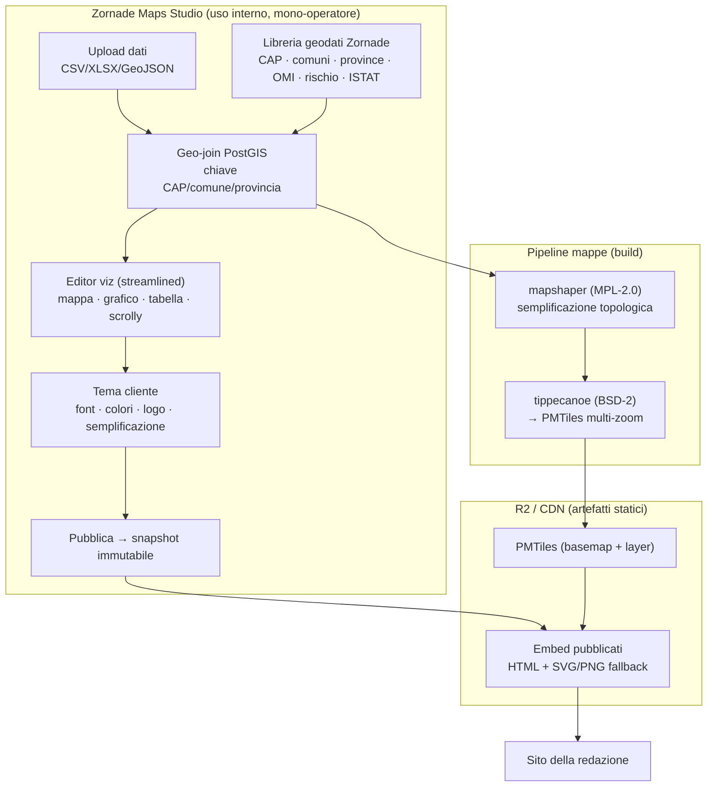

# Zornade Studio — Strumento di produzione interno per mappe e visualizzazioni editoriali

> **Nome prodotto confermato:** **Zornade Studio** (dominio target: `studio.zornade.com`).

> **Data:** 9 giugno 2026 · **Versione:** 2 (sostituisce la precedente analisi)
> **Contesto:** dovendo comunque produrre mappe/visualizzazioni per Altreconomia e per altre
> redazioni, l'obiettivo è dotarsi di **uno strumento di produzione interno** — una "versione Zornade
> di Flourish/Felt/Datawrapper" — che **io** (operatore singolo) uso per creare le mappe, che poi le
> redazioni **embeddano** nei loro siti. Ogni embed **punta a Zornade** (attribuzione → brand + SEO).
> Modello iniziale: **pagamento a mappa**; evoluzione futura possibile: open source **oppure** SaaS a
> sé stante.
> **Requisiti dichiarati:** semplice e *streamlined*; tutte le personalizzazioni che servono alle
> newsroom; costruito su **strumenti open source rispettandone le licenze**.

---

## 1. Sommario esecutivo (TL;DR)

**Cosa costruiamo (v1).** Uno **studio interno mono-operatore**: un'app web in cui carico i dati
(CSV/Excel/GeoJSON), li combino con i **geodati italiani Zornade** (CAP, comuni, province, catasto,
OMI, rischio, ISTAT…), genero mappe/grafici/tabelle/scrollytelling con un'interfaccia *streamlined*,
applico il **tema del cliente** (font, colori, logo) e **pubblico un embed** che la redazione incolla
nel proprio sito. L'embed è uno **snapshot statico "a prova di futuro"** ospitato su R2/CDN, con un
**link di attribuzione a Zornade**.

**Cosa NON serve in v1 (e perché è una buona notizia).** Rispetto all'ipotesi precedente (SaaS
self-serve multi-tenant), qui l'utente sono **io**: niente login per le redazioni, niente isolamento
multi-tenant, niente RLS, niente onboarding self-service. La complessità si sposta dove conta davvero:
una **UX di autoring veloce**, una **libreria geodati italiani con join automatico**, e una
**pipeline di embed/export blindata**. Questo rende l'MVP molto più rapido e a basso rischio.

**Il valore difendibile (perché un cliente paga me e non Flourish).**
1. **Geodati italiani già pronti + join automatico** su CAP/comune/provincia: la redazione mi manda un
   CSV "comune → valore" e ottengo una coropletica corretta in minuti. Flourish/Datawrapper non lo
   danno pronto per l'Italia.
2. **Servizio "chiavi in mano"**: la redazione non deve imparare uno strumento, lo faccio io.
3. **Mappe che "funzionano per sempre"** (angolo Protomaps): embed statici, nessuna dipendenza da API
   a consumo che un domani può cambiare prezzo o spegnersi.

**Stack OSS, tutte licenze permissive (requisito rispettato).** MapLibre GL JS (BSD-3), Protomaps
**PMTiles** (BSD-3) + **tippecanoe** (BSD-2) per i tile, **mapshaper** (MPL-2.0) per la
semplificazione topologica dei confini, **Vega-Lite** (BSD-3)/**Observable Plot** (ISC)/**ECharts**
(Apache-2.0) per i grafici, **Scrollama** (MIT) per lo scrollytelling, **PostGIS** (GPLv2, solo come
DB server → nessuna contaminazione). **Unica trappola da evitare:** `iframe-resizer` v5 è
**GPLv3/commerciale** → uso **pym.js** (MIT) o un mini-resizer `postMessage` custom.

**Pricing (proposto): a mappa + opzioni.** Prezzo per singola mappa/visualizzazione, sconti a
pacchetto, e **retainer** mensile per redazioni ricorrenti. Posizionamento di riferimento: il costo
"fatto in casa" deve risultare **inferiore** a quello di abbonarsi a Datawrapper Custom (≈ $5.990/anno)
o di commissionare studi di dataviz esterni, **ma** con il plus dei dati italiani inclusi.

**Strategia di crescita (il vero asset di lungo periodo).** Ogni mappa pubblicata su una testata è un
**backlink "Fatto con Zornade Studio" da un dominio editoriale ad alta autorità** → SEO + esposizione del
brand presso altre redazioni. Lo strumento è insieme un generatore di fatturato (a mappa) **e** un
motore di link-building/marketing che si auto-alimenta sulla lista outreach già esistente (138+ testate).

**Percorso evolutivo già previsto nell'architettura.** Il **core "spec-driven"** (ogni viz è un JSON
dichiarativo) + gli **embed statici su R2** rendono naturale, in un secondo tempo, aggiungere **sopra**
lo stesso motore un layer di autenticazione multi-tenant per trasformare lo studio interno in un
**SaaS self-serve** o in un progetto **open source**, senza riscrivere il cuore.

---

## 2. Cosa cambia rispetto alla prima ipotesi

| Aspetto | Ipotesi precedente (SaaS self-serve) | **Questa ipotesi (studio interno)** |
|---|---|---|
| **Chi crea le mappe** | Le redazioni, da sole | **Io** (operatore singolo, servizio gestito) |
| **Auth / multi-tenant** | Necessari (subdomini, RLS) | **Non necessari in v1** |
| **UX prioritaria** | Onboarding self-service per non-tecnici | **Velocità di autoring per me** |
| **White-label** | Per tenant, automatico | **Tema per cliente**, gestito da me |
| **Monetizzazione** | Abbonamenti a fasce | **A mappa / a progetto / retainer** |
| **Time-to-MVP** | Lungo (piattaforma) | **Breve** (tool focalizzato) |
| **Rischio** | Alto | **Basso** |
| **Evoluzione** | È già il prodotto finale | Può **diventare** SaaS o OSS dopo |

> In sintesi: **stesso cuore tecnologico, molta meno impalcatura**. Si parte snelli e si tiene aperta
> la strada verso il prodotto più ambizioso.

---

## 3. Obiettivi e principi di design

1. **Streamlined**: dal dato all'embed in pochi passi (carico → abbino a geodati → scelgo viz →
   personalizzo tema → pubblico).
2. **Tutte le personalizzazioni utili alle newsroom**: titoli/sottotitoli/note fonte, palette e font
   del cliente, logo, legenda, tooltip, formattazione numeri/date in italiano, **livello di
   semplificazione dei confini**, scelta basemap, annotazioni/etichette, responsive.
3. **OSS rispettando le licenze** (vedi §5): preferenza per licenze permissive; evitare trappole
   copyleft nei componenti distribuiti (es. iframe-resizer v5).
4. **Embed che dura**: artefatti **statici** su CDN, nessuna dipendenza runtime fragile.
5. **Attribuzione → Zornade** su ogni embed (brand + SEO), in forma elegante e non invasiva.
6. **Spec-driven**: ogni viz è un documento JSON dichiarativo, separato dal rendering → estendibile e
   "a prova di futuro".

---

## 4. Panorama competitivo e prezzi (verificato 2026-06-09)

Servono per due ragioni: (a) capire **cosa eviterei di pagare** facendo in casa; (b) avere un
**benchmark** per il mio prezzo a mappa verso i clienti.

> Flourish e Felt **non pubblicano** i prezzi dei piani team/enterprise; valori da fonti terze (ITQlick).

| Prodotto | Free | Piano pro/white-label | Enterprise | Note |
|---|---|---|---|---|
| **Datawrapper** | Sì (con attribuzione) | **Custom: $599/mese o $5.990/anno** (10 utenti, white-label, SVG/PDF, no attribuzione; +$21/utente/mese; +$249/mese per tema extra) | Custom: self-host, SSO, SLA | Standard nelle redazioni. Niente geodati italiani pronti. |
| **Flourish** (Canva) | Sì (con attribuzione) | **Publisher** (team, scrollytelling, no attribuzione, 1 tema, live data, export HTML) — **prezzo nascosto** (~$29/utente/mese; ~$199/mese 10 utenti) | SSO, live rendering API, temi multipli | Forte su storytelling/scrollytelling. |
| **Infogram** (Prezi) | Sì | Pro $19/mese; **Business $67/mese** (white-label, logo, SQL/iframe); **Team $149/mese** | Custom: subdominio brandizzato, SSO | Riferimento utile per fasce di prezzo. |
| **Felt** | Personal gratis | **Professional** (10 seat, embed, dashboard, plugin QGIS) — prezzo non pubblico | PostGIS/Snowflake live sync, REST API+SDK, SSO, EU residency | GIS cloud, molto forte sulle mappe; dati di default negli USA. |
| **Observable** | Sì | A editor (~$25/editor/mese, storico) | Custom | Pricing non recuperabile (CSP); Framework OSS in possibile declino. |

**Lettura per il caso "a mappa".** Una redazione che oggi vuole una mappa interattiva su misura o
paga un abbonamento (e impara lo strumento), o commissiona uno studio esterno. Il mio servizio si
inserisce **tra i due**: prezzo a mappa accessibile, zero curva di apprendimento per il cliente, e
**dati italiani inclusi**. Conviene tenere il prezzo per mappa **sotto il costo mensile di un piano
pro** (così la singola commessa è una scelta facile) e usare i **retainer** per i clienti ricorrenti.

---

## 5. Stack open source e conformità alle licenze

Tutti i componenti del **core distribuito** sono a **licenza permissiva**; il copyleft compare solo in
strumenti usati come **processi esterni di build** (mapshaper) o come **DB server** (PostGIS), senza
contaminare il codice del prodotto.

| Componente | Ruolo | Licenza | Nota di conformità |
|---|---|---|---|
| **MapLibre GL JS** | Rendering mappe nel browser | **BSD-3-Clause** | Permissiva, nessun vincolo. |
| **Protomaps PMTiles** | Basemap/layer come singolo file statico su R2 | **BSD-3-Clause** (spec CC0/PD) | Permissiva. |
| **deck.gl** | Overlay GPU su MapLibre: heatmap, hexbin, dot-density, flussi, estrusione 3D | **MIT** (OpenJS) | Permissiva; integrazione ufficiale `MapboxOverlay` con MapLibre. Anche la libreria mappe "di moda" oggi. |
| **tippecanoe** (fork Felt) | Generazione vector tiles/PMTiles (ha `--visvalingam`, shared borders) | **BSD-2-Clause** | Permissiva; usato come CLI di build. |
| **mapshaper** | Semplificazione **topology-aware** dei confini | **MPL-2.0** | Copyleft *a livello di file*: usato come tool di build, nessun obbligo sul nostro codice. |
| **Observable Plot** | Grafici **statistici** (motore primario, SVG) | **ISC** | Permissiva. Barre/linee/aree/dispersione/istogramma/box plot/beeswarm/ridgeline/dumbbell/slope. |
| **Apache ECharts** | Grafici **ricchi/relazionali/animati/3D** | **Apache-2.0** | Permissiva. Torta/funnel/gauge/sankey/chord/rete/treemap/sunburst/parallel/radar/calendar/candele/streamgraph/bar-chart-race. |
| **Vega-Lite** | Spec dichiarativa / interscambio & export | **BSD-3-Clause** | Permissiva. Tenuta come formato di spec, **non** come terzo runtime di default. |
| **Scrollama** | Scrollytelling (trigger su scroll) | **MIT** | Permissiva. |
| **Turf.js** | Operazioni geo lato client | **MIT** | Permissiva. |
| **DuckDB / DuckDB-WASM** | Profiling/aggregazione dati veloce | **MIT** | Permissiva. |
| **PostGIS** (su Postgres/Supabase) | Join geometrico, geoprocessing | **GPLv2** | **Solo DB server esterno** → nessuna contaminazione del prodotto. |
| **iframe-resizer v5** | Resize responsive iframe | **GPLv3 / commerciale** | ⚠️ **Da evitare** in prodotto chiuso. |
| **pym.js** (NPR) | Resize responsive iframe (alternativa) | **MIT** | ✅ Scelta consigliata, o mini-resizer custom. |

**Conclusione licenze:** lo stack è **pulito**. L'unico punto di attenzione è il resizer dell'iframe:
si usa **pym.js (MIT)** o si scrive un piccolo resizer `postMessage` (poche righe). I tile basemap
derivati da **OpenStreetMap** richiedono l'**attribuzione ODbL** (peraltro coerente con la nostra
attribuzione a Zornade).

**Librerie di grafica "di moda" valutate (2026-06-12).** Chart.js (MIT), ApexCharts (MIT), Plotly.js
(MIT), Recharts (MIT), Nivo (MIT), visx (MIT), D3 (ISC), TradingView Lightweight Charts (Apache-2.0):
le licenze sono **tutte permissive** e quindi compatibili. **Verdetto:** non si aggiunge un quarto
runtime di grafici — **Observable Plot** (statistici) + **Apache ECharts** (ricchi/animati/3D) coprono
l'intero catalogo, e Plotly.js (~3 MB) o i wrapper React (Recharts/Nivo/visx) sarebbero ridondanti e
pesanti. L'unica **aggiunta strategica** è **deck.gl (MIT)** per le mappe GPU (heatmap/hexbin/flussi/3D),
che nessun altro motore copre altrettanto bene. La mappatura completa tipo-di-viz → motore è in
`ROADMAP.md` §1.11.

> **Fonte canonica dello stack:** versioni, licenze e pesi gzip **verificati** (npm registry +
> Bundlephobia + release notes, 2026-06-12) vivono in **`ROADMAP.md` §1.11–§1.13**. In sintesi
> verificata: MapLibre 5.24.0 (BSD-3, ~268 KB gz), deck.gl 9.3.4 (MIT), Observable Plot 0.6.17 (ISC,
> ~125 KB gz), Apache ECharts 6.1.0 (Apache-2.0, ~359 KB gz), Vega-Lite 6.4.3 (BSD-3). Parser formati:
> SheetJS `xlsx` 0.20.3 (Apache-2.0) **solo da CDN ufficiale** (npm fermo a 0.18.5, pre-fix
> prototype-pollution 0.19.3), `shapefile` 0.6.6 (BSD-3), `@tmcw/togeojson` 7.1.2 (BSD-2), `geotiff`
> 3.0.5 (MIT), DuckDB-WASM (MIT, lazy). MapLibre **v5** confermato (globe, GlobeControl; migrazione
> da v4.7.1 con breaking change documentati).

---

## 6. Architettura proposta (studio interno, evolvibile)

### 6.1 Vista d'insieme

### 6.2 Il cuore: architettura "spec-driven"

Ogni visualizzazione è un **documento JSON dichiarativo** separato dal motore di rendering:
- **Grafico** → **Observable Plot** (statistici) o **Apache ECharts** (ricchi/animati/3D); Vega-Lite come spec di interscambio. Un dispatch `vizType → engine` sceglie il renderer (vedi `ROADMAP.md` §1.11).
- **Mappa** → spec **MapLibre style** + layer PMTiles + encoding (campo → colore/scala); **deck.gl** come overlay GPU per heatmap/hexbin/flussi/3D.
- **Tabella** → spec colonne/formattazione.
- **Scrollytelling** → sequenza di *step* (testo + spec di viz), trigger con **Scrollama**.

Vantaggi: estensione **additiva** (nuovo tipo di viz = nuova mappatura `spec → renderer`); **doppio
output** dalla stessa spec — interattivo (iframe) **e** statico (SVG/PNG) per email/stampa/anteprime
social/SEO e come fallback; **snapshot immutabili** alla pubblicazione (l'embed di un articolo non
cambia se in seguito ritocco il progetto).

### 6.3 Killer feature: geo-join + semplificazione topologica dei confini

1. **Geo-join.** Il dato del cliente con chiave CAP/codice comune ISTAT/provincia viene unito alle
   **geometrie Zornade in PostGIS** → layer pronto. È il valore che gli strumenti generalisti non
   danno pronto per l'Italia.

   > **Nota di coerenza con l'implementazione (2026-06-12).** Esistono **due percorsi di join**, non in
   > conflitto: **(a)** per i **CSV caricati dall'utente** il join è **client-side** nel browser contro
   > le geometrie bundled (oggi `src/lib/choropleth.ts`, livello regioni; ROADMAP O1.3) — zero
   > infrastruttura, embed statico; **(b)** per i **dataset DB Zornade** (OMI/rischio/solare) il join è
   > **server-side in PostGIS** dietro il proxy read-only (ROADMAP O3.1), dove le geometrie già
   > risiedono. La semplificazione topologica qui sotto resta uno step di **build** in entrambi i casi.
2. **Semplificazione mantenendo la topologia.** Attenzione tecnica chiave:
   - `ST_SimplifyPreserveTopology` di PostGIS preserva la topologia **della singola geometria**, ma su
     poligoni confinanti **introduce buchi/sovrapposizioni** lungo i confini condivisi.
   - La via corretta è la semplificazione **topology-aware** (condivisa tra poligoni vicini):
     **mapshaper** (algoritmo Visvalingam, topology-aware) come step di build, **oppure** tippecanoe
     con `--visvalingam` + `--no-simplification-of-shared-nodes`.
   - **Approccio consigliato:** pre-calcolare i confini a **più livelli** con mapshaper → generare
     **PMTiles multi-zoom** con tippecanoe → servirli statici da R2. Il "livello di dettaglio" diventa
     una delle personalizzazioni offerte alle redazioni.

### 6.4 Personalizzazioni per le redazioni

Tema per cliente come set di **token** (font self-hosted con licenza idonea, palette, logo, basemap,
livello di semplificazione di default) + opzioni per singola viz: titolo/sottotitolo/nota fonte,
legenda, tooltip, formattazione numeri/date in italiano, annotazioni, dimensioni/responsive.

### 6.5 Embed "a prova di futuro" + attribuzione

- Embed = **snapshot statico** (HTML + asset) su **R2/CDN**, versionato/immutabile.
- Resize responsive con **pym.js (MIT)** o mini-resizer `postMessage` (evita la GPL di iframe-resizer v5).
- **oEmbed** per i CMS (WordPress di Altreconomia): incolli l'URL e l'embed appare.
- **Fallback statico SVG/PNG** dalla stessa spec (email, stampa, SEO, no-JS).
- **Attribuzione**: link discreto "Fatto con **Zornade Studio**" → vedi §7. Sicurezza embed: `sandbox`,
  CSP, niente esecuzione di codice del cliente lato server.

---

## 7. Attribuzione e flywheel SEO/brand

Ogni mappa pubblicata su una testata porta un **backlink "Fatto con Zornade Studio** verso il sito. Le
testate sono **domini ad altissima autorità** → ogni embed = **link editoriale di qualità** (forte
beneficio SEO per `zornade.com`) **più** esposizione del brand presso altre redazioni che vedono
l'embed. Il tutto si innesta sulla **lista outreach già esistente** (`outreach/comunicato_stampa_2026_05/`:
~138 testate locali + lista nazionale Tier-1). Lo strumento diventa così **fatturato a mappa** **e**
**motore di marketing/link-building** difficile da replicare. Suggerimento: offrire la mappa a prezzo
ridotto (o gratis) in cambio dell'attribuzione visibile, per i clienti "faro".

---

## 8. Pricing a mappa (proposta) e percorso evolutivo

### 8.1 Modello a mappa/progetto (v1)

| Voce | Indicativo | Note |
|---|---|---|
| **Mappa/visualizzazione singola** | prezzo a unità | coropletica/punti/grafico/tabella standard, con dati Zornade inclusi |
| **Pacchetto** (N mappe) | sconto a volume | per inchieste/dossier |
| **Scrollytelling / interattivo complesso** | premium | più step, annotazioni, narrazione |
| **Retainer mensile** | abbonamento | redazioni ricorrenti: X mappe/mese + priorità |
| **Sconto "faro"** | ridotto/gratis | in cambio di attribuzione visibile + case study |

Principio di posizionamento: la **singola mappa deve costare meno** del valore percepito di un mese di
abbonamento a uno strumento pro o di una commessa esterna, così la decisione del cliente è facile; il
margine ricorrente arriva dai **retainer**.

### 8.2 Evoluzione (già abilitata dall'architettura)

- **Open source**: rilasciare il core (spec-driven + renderer) come progetto OSS → community, brand,
  posizionamento "europeo/aperto"; monetizzazione su servizi/hosting/dati. La scelta della licenza
  resta aperta (open-core consigliato).
- **SaaS self-serve**: aggiungere **sopra** lo stesso core un layer Auth multi-tenant (Supabase + RLS,
  subdomini) → le redazioni creano da sé. È esattamente l'ipotesi precedente, ma raggiunta in modo
  **incrementale e validato dal mercato**, non *big-bang*.

---

## 9. Scalabilità e manutenibilità

- **Artefatti statici su CDN**: gli embed sono per lo più file statici cache-abili → scala senza
  costi server per-richiesta.
- **Mappe a costo marginale ~zero**: PMTiles su R2 (niente fatture per "map views").
- **Riuso** dell'infrastruttura esistente (`app/`): Supabase/Postgres/PostGIS, R2, React/Vite,
  design system shadcn/Tailwind.
- **Estensione additiva** grazie all'architettura spec-driven.

---

## 10. Roadmap a fasi

- **Fase 0 — Spike (giorni).** PoC: CSV per comune → join PostGIS → coropletica MapLibre + basemap
  PMTiles → embed iframe responsive con attribuzione. Valida il flusso end-to-end.
- **Fase 1 — MVP studio interno.** Upload dati; libreria geodati Zornade + geo-join; 1 mappa + 2–3
  grafici (Vega-Lite) + tabella; tema cliente (font/colori/logo/semplificazione); pubblicazione embed
  + oEmbed WordPress; export PNG/SVG. **Lo uso per le prime mappe di Altreconomia.**
- **Fase 2 — Suite completa.** Scrollytelling (Scrollama); annotazioni; più tipi di mappa
  (bubble/punti/categorie); versioning/snapshot; libreria temi clienti.
- **Fase 3 — Packaging.** Pulizia, documentazione, eventuale rilascio **open source** del core e/o
  layer multi-tenant per il **SaaS self-serve**.

---

## 11. Rischi e questioni aperte

| Tema | Rischio | Mitigazione |
|---|---|---|
| **Licenza iframe-resizer v5 (GPL)** | Contaminazione/licenza a pagamento | **pym.js (MIT)** o mini-resizer custom |
| **Topologia confini** | `ST_SimplifyPreserveTopology` lascia slivers | **mapshaper**/tippecanoe topology-aware, PMTiles multi-zoom |
| **Font / basemap** | Licenze font; attribuzione OSM (ODbL) | Font self-hosted con licenza idonea; attribuzione OSM+Zornade |
| **Tempo operatore** | Tutto il lavoro mappe ricade su di me | Template riutilizzabili + spec-driven per velocizzare; retainer per prevedibilità |
| **Sicurezza embed** | XSS/clickjacking | `sandbox`, CSP, niente codice cliente lato server |
| **Licenza prodotto** | Scelta differita | Open-core consigliato; decidere prima dell'eventuale rilascio |
| **GDPR** | Dati clienti | Tutto in UE (Supabase EU); embed senza tracker di terzi |

---

## 12. Decisioni che mi servono da te per procedere

1. **Conferma framing v1**: studio interno mono-operatore (no login redazioni in v1)?
2. **Resizer embed**: ok a **pym.js (MIT)**/mini-resizer custom (per evitare la GPL)?
3. **Confini topologici**: ok all'approccio **mapshaper/tippecanoe** (Visvalingam) descritto in §6.3?
4. **CMS Altreconomia**: WordPress? (→ priorità a oEmbed)
5. **Pricing**: vuoi che proponga **numeri concreti** a mappa/retainer (richiede stima dei tuoi costi/tempi)?
6. **Parto con la Fase 0 (spike tecnico)** per validare subito join + mappa + embed?
